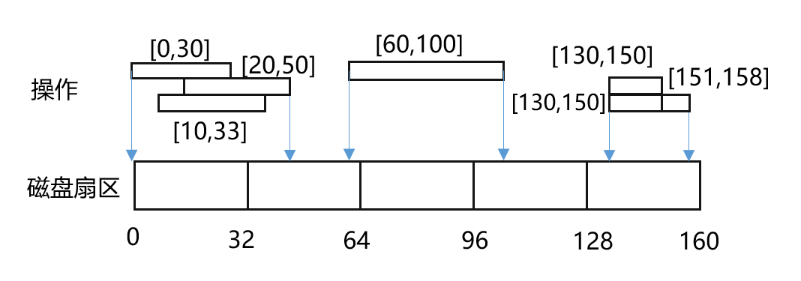

```
考试前应用号题目做一下
```


### OJ练习


- **典型试题开放列表：https://3ms.huawei.com/km/groups/3803117/blogs/details/9606176?l=zh-cn**
- **软件开发能力认证“案例开放”：http://3ms.huawei.com/km/groups/3803117/blogs/details/9595962?l=zh-cn**
- **软件认证：https://oj.rnd.huawei.com/problems/all （优先困难 -> 中等）**


------


#### ✅2023-10.13-1 栈模拟计算器

```python
/**
     * 题目：使用栈模拟计算器的基本操作，该计算器共有a~t 20个栈，其中共有PUSH、POP、ADD、MUL、DIV五个操作
     * PUSH(stack_name， num)：将num压入对应的栈中，若栈中大小超过32，则什么都不做
     * POP（stack_name, num）：将栈顶对应数字弹出栈
     * ADD（stack_name1，stack_name2）：将栈1和栈2栈顶数字相加，并将结果更新到栈1栈顶
     * MUL（stack_name1，stack_name2）：将栈1和栈2栈顶数字相乘，并将结果更新到栈1栈顶
     * DIV（stack_name1，stack_name2）：将栈1和栈2栈顶数字相除，并将商更新到栈1栈顶，将余数更新至栈2栈顶
     * 注意：1.所有操作均合法（不存在POP空，除0的情况）
     * 2.若计算结果大于1024，则对结果取余
     * 3.若栈为空，输出-1
     * 例1：输入：instructions = ["PSH a 8", "PSH d 3", "PSH c 3", "ADD a c", "DIV a c", "MUL d c", "POP c"]
     * 输出：[3, -1, -1, 6, -1, -1, -1, -1, -1, -1, -1, -1, -1, -1, -1, -1, -1, -1, -1, -1]
     */
```


------


#### ✅2023-10.13-2 磁盘IO合并与拆分

http://oj.rnd.huawei.com/problems/3599/details

**题目描述**

在计算机系统中，跨扇区磁盘操作较慢，需要实现一个磁盘操作的合并和拆分功能，保持磁头按照地址从小到大移动，提升系统性能。

有一个磁盘系统，磁盘地址从 0 开始；每`sectorSize` 字节作为一个扇区，如第 n （从 0 开始） 个扇区的地址区间为 [sectorSize *n, sectorSize* (n+1) - 1] 。

现给出对磁盘扇区一系列读操作 `opArray`，每个操作 `opArray[i] = [startAddr, endAddr]` （左闭右闭）。请对所有读操作的**地址区间进行合并**，然后把合并后的地址区间**按扇区进行拆分**，最后按照地址**从小到大**依次输出新的地址区间（左闭右闭）。
下图对应示例1，[0, 30], [20, 50], [10, 33] 合并后的地址区间为 [0, 50]，假如 sectorSize = 32，则拆分后的输出为 [0, 31], [32, 50] 。


**解答要求**时间限制：1000ms, 内存限制：256MB

**输入**

第一个参数为扇区大小 `sectorSize`，32 <= sectorSize <= 2048，且sectorSize为2的幂
第二个参数为操作列表 `opArray`，0 <= opArray.length <= 10000，0 <= opArray[i].startAddr <= opArray[i].endAddr < 2^31

**输出**

合并后的区间列表。**注意**：用例保证输出的列表大小 <= 10000

**样例**

输入样例 1 复制

```
32
[[0, 30], [10, 33], [130, 150], [151, 158], [60, 100], [130, 150], [20, 50]]
```

输出样例 1

```
[[0, 31], [32, 50], [60, 63], [64, 95], [96, 100], [130, 158]]
```

提示样例 1

参考上图。
对地址区间进行合并后为 [0, 50], [60, 100], [130, 158]； 注意：[130, 150] 有两次操作。
然后按照扇区大小拆分到每个扇区上，如 [60,100] 拆分到3个扇区上，为[60, 63], [64, 95], [96, 100]；
其他依次类推。

输入样例 2 复制

```
64
[[77, 128], [130, 130], [2147483502, 2147483632], [2147483600,  2147483647]]
```

输出样例 2

```
[[77, 127], [128, 128], [130, 130], [2147483502, 2147483519], [2147483520, 2147483583], [2147483584, 2147483647]]
```

提示样例 2

无


------


#### ✅2023-09.08-1. 浏览器历史记录

http://oj.rnd.huawei.com/problems/3589/details

**题目描述**


打开一个浏览器，此浏览器窗口一般具备浏览历史的特性（如上图所示），请实现如下功能：

- `BrowserHistorySys(string homepage, int maxCount)` — 初始化。`homepage`作为**当前页**，并缓存到**浏览历史**中；浏览历史中最多缓存`maxCount`个网页。

- `visit(string url)` — **跳转访问**页面`url`，返回访问后浏览历史中的缓存页面数量。

  - 如果入参 url 仍是当前页，则继续浏览此页面，即：当前页不变，且浏览历史也不变；

  - 如果入参 url 不是当前页，则跳转到此 url，并把此 url 页面作为当前页； 同时清除浏览历史中原当前页的**前进记录**，再将此 url 缓存到浏览历史中。示意如图：

    

    

    

    当前页为：google.com，此时跳转访问mails.huawei.com，则：
    \- 清除前进记录
    \- 跳转访问 mails.huawei.com
    \- 当前页变为 mails.huawei.com
    \- 最新当前页进入缓存浏览历史

    

  - 如果新增缓存后，浏览历史缓存页面数量超过 maxCount, 则清除浏览历史中最早的记录。

    

- `back()` — 在浏览历史中从当前页**后退**一步，返回停留页面的 url，并作为当前页。

  - 注：如果已退无可退，则不再后退，继续停留在当前页。

- `forward()` — 在浏览历史中从当前页**前进**一步，返回停留页面的 url，并作为当前页。

  - 注：如果已进无可进，则不再前进，继续停留在当前页。

**解答要求**时间限制：1000ms, 内存限制：256MB

**输入**

每行表示一个函数调用，初始化函数仅首行调用一次，累计函数调用不超过 100 次。

> homepage、url的合法集合为[0-9a-z./]，即：小写字母，数字，点和斜线。输入保证合法。
> 8 <= homepage.length, url.length < 32, 0 < maxCount < 20

**输出**

输出每个命令的执行结果

**样例**

输入样例 1 复制

```
BrowserHistorySys("w3.huawei.com", 10)
visit("google.com")
back()
forward()
forward()
visit("baidu.com")
visit("youtube.com")
back()
visit("baidu.com")
back()
visit("mails.huawei.com")
```

输出样例 1

```
null
2
"w3.huawei.com"
"google.com"
"google.com"
3
4
"baidu.com"
4
"google.com"
3
```

提示样例 1

首次操作—初始化：当前页为 “w3.huawei.com”，缓存为 [“w3.huawei.com”]，容量10
第二次操作 = visit(…)：缓存为[“w3.huawei.com”, “google.com”]，数量为 2，当前页是 “google.com”，注：无前进记录可清理
第三次操作 = back()，当前页面回到 “w3.huawei.com”
第四次操作 = forward()：当前页面又到 “google.com”
第五次操作 = forward()，进无可进，当前页仍停留在 “google.com”
第六次操作 = visit(…)：缓存变为[“w3.huawei.com”, “google.com”,”baidu.com”]，当前页为”baidu.com”
第七次操作 = visit(…)：缓存变为[“w3.huawei.com”, “google.com”,”baidu.com”,”youtube.com”]，并把当前页置为 “youtube.com”
第八次操作 = back()，当前页变为 “baidu.com”
第九次操作 = visit(…)：url和当前页相同，缓存和当前页都保持不变
第十次操作 = back(), 当前页变为”google.com”
最后操作 = visit(…)：url和当前页不同，如题干图所示

输入样例 2 复制

```
BrowserHistorySys("www.huawei.com", 3)
visit("w3.huawei.com")
visit("w4.huawei.com")
back()
visit("www.huawei.com")
visit("w5.huawei.com")
visit("w6.huawei.com")
```

输出样例 2

```
null
2
3
"w3.huawei.com"
3
3
3
```

提示样例 2

首次操作：初始化
第二次操作 = visit(…)：操作后缓存为 [www.huawei.com, w3.huawei.com]
…
第五次操作 = visit(…)：操作后缓存为 [www.huawei.com, w3.huawei.com, www.huawei.com]
第六次操作 = visit(…)：操作后缓存为 [w3.huawei.com, www.huawei.com, w5.huawei.com]，当前页面是：w5.huawei.com，注：超过缓存容量上限时，首个www.huawei.com最早，优先删除
第七次操作 = visit(…)：，缓存为 [www.huawei.com, w5.huawei.com, w6.huawei.com]，当前页面为 w6.huawei.com。注：超过缓存容量上限时，w3为当前更早，优先删除


------


#### ✅2023-08.11-1. 双遥控电路

https://3ms.huawei.com/km/groups/3803117/blogs/details/14650115?l=zh-cn

实验室对一个设备进行通断测试，实验员可以操控开关进行通断，有两种情况：


初始时，3个开关的状态均为断开；现给定实验员操控记录的数组 records ，records[i] = [time, switchId]，表示在时刻 time 更改了开关 switchId 的状态。

开关 switchId 仅为 1、2、3，状态是**从断开变成闭合**、或**从闭合变成断开**。

测试中为了避免设备过热，若开关在时刻 time 闭合，且在 [time, time + limit) 区间内未接收到指令，则：

·     在时刻 time + limit 该开关自动变为断开；若**此时恰好**收到指令，则该开关再次变为闭合。

请返回完成最后一次操作、且所有开关状态变为断开后，设备的累计工作时长。

**示例** **1：**

输入：
records = [[0,1],[1,3],[2,2],[3,3],[4,1],[4,3]]
limit = 3

输出：5

解释：如下图所示，
在时刻 0 更改开关1，开关1切换到闭合，此时设备未工作；
在时刻 1 更改开关3，开关3切换到闭合，此时设备工作；
在时刻 2 更改开关2，开关2切换到闭合，此时设备工作；
在时刻 3 更改开关3，开关3切换到断开，虽然开关2 状态为闭合，但是开关1已自动断开，所以此时设备开始不工作；
在时刻 4 更改开关 1、3，开关1、3切换到闭合，此时设备工作；
在时刻 5，开关 2 自动断开；
在时刻 7，开关 1、3 自动断开，此后设备不再工作；
因此在 [1, 3) 和 [4, 7) 的时间段中，设备工作，返回 (3 - 1) + (7 - 4) = 5。


**示例** **2****：**

输入：
records = [[3,3],[4,1],[5,2],[6,1],[7,3],[8,1],[11,3]]
limit = 4

输出：6

解释：如下图所示，其中：
在时刻 7，开关 3 自动断开，但此时恰好收到指令，开关 3 再次闭合；
在时刻 11，开关 3 自动断开，但此时恰好收到指令，开关 3 再次闭合；
最终，在 [4, 6) 和 [8, 12) 的时间段中，设备工作，返回 6。


**提示：**

·     1 <= records.length <= 10^3

·     0 <= records[i][0] <= records[i+1][0] <= 10^3

·     1 <= limit <= 10^3

·     records[i][1]仅包含 1,2,3

·     用例保证同一时刻对同一开关只有一次操作


------


#### ✅2023-07.14-1. 容器资源分配

http://oj.rnd.huawei.com/problems/3569/details

**题目描述**

容器化是当前云化趋势下的一种重要技术，容器运行需要足够的CPU资源，请实现一种CPU分配机制，满足如下设计要求：


- 假设所有虚拟机的 CPU核数都为 `cpuCore` 。
- 为了满足可靠性要求，每个虚拟机上**最多部署 2 个**容器；一个容器占用一定数量的 CPU 核数，一个虚拟机上容器占用的CPU核数总和不能超过 `cpuCore` 。

现有 A、B 两个业务，每个业务都有一个或多个微服务，每个微服务独占一个容器：

- 承载业务A 的每个容器需要的CPU核数记录于 `serviceA` 中，serviceA.length 为容器数量，serviceA[i] 表示容器 i 所需的CPU核数。业务B 的信息 `serviceB` 含义同理。
- 业务A 需要支持**反亲和**策略，即业务A 的任意两个容器不能运行在同一个虚拟机上；业务B **不需要**反亲和。

请计算**最少**需要多少个虚拟机才能满足这两个业务的资源要求？

**解答要求**时间限制：800ms, 内存限制：256MB

**输入**

首行三个整数`cpuCore serviceA.length serviceB.length`
第二行是 serviceA
第三行是 serviceB

> 2 <= cpuCore <= 1000
> 1 <= serviceA.length, serviceB.length <= 10^5, 1 <= serviceA[i], serviceB[i] <= cpuCore

**输出**

一个整数，表示最少需要多少个虚拟机

**样例**

输入样例 1 复制

```
32 3 2
16 8 16
2 7
```

输出样例 1

```
3
```

提示样例 1

- 每个虚拟机的CPU核数固定为 32， 业务A 的 3 个容器的CPU核数需求为 16、8、16，业务B 的 2 个容器的CPU核数需求为 2、7 。
- 由于A业务的反亲和要求，需要虚拟机的数量至少和A业务容器数相同，即 3 个；其中一种利用 3 个虚拟机满足CPU资源需求的分配方案为：
  虚拟机1：(A:16，B:2)
  虚拟机2：(A:8，B:7)
  虚拟机3：(A:16)

> 注意：每个虚拟机最多部署2个容器

输入样例 2 复制

```
64 3 5
32 8 16
32 16 54 16 16
```

输出样例 2

```
4
```

提示样例 2

最少需要 4 个虚拟机。可以有多个分配方案，其中之一：
虚拟机1：(A:32，B:32)
虚拟机2：(A:8，B:54)
虚拟机3：(A:16，B:16)
虚拟机4：(B:16，B:16)


------


#### ✅2023-06.16-1. 单词匹配2

http://oj.rnd.huawei.com/problems/3565/details

**题目描述**

在一个字符矩阵中，可把横向或竖向**连续相邻**的字符、按顺序组成一个单词，例如下图所示的 XE、ACX、STJIIE


给定一个字符矩阵 charMatrix 和目标单词列表 words，请计算这个字符矩阵可以组成多少个 words 中的单词，并返回这个数量：

- 矩阵中每个格子的字符，对于同一个单词不能重复使用；在不同的单词之间可以重复使用。
- 格子字符为 `?` 表示通配符，可以匹配**任一字母**。

**解答要求**时间限制：1000ms, 内存限制：256MB

**输入**

首行两个整数 rows 和 cols，1 <= rows, cols <= 5
随后 rows 行，每行有 cols 个字符，表示给定的字符矩阵，字符矩阵仅由大写字母或字符`?`组成
最后两行输入单词数量及单词列表 words，单词仅由大写字母组成，且单词不重复，1 <= words.length <= 100，1 <= words[i].length <= 8

**输出**

一个整数，表示字符矩阵可以组成 words 中的单词数量

**样例**

输入样例 1 复制

```
3 4
ACEI
EX?I
SSTJ
8
ACX II STJIIE XE NXE ACA ACECTJ ACETJ
```

输出样例 1

```
6
```

提示样例 1

ACX, II, STJIIE, XE 这四个单词可由矩阵中连续相邻格子的字符组成。
利用通配符后，单词 NXE 可由矩阵中 ?XE 组成； 同理 ACECTJ 也可组成。
但 ACA 和 ACETJ 无法组成。

输入样例 2 复制

```
5 5
A?JFL
J?ASD
DG?OI
G??GB
A?OFC
7
A AA AAA AAAAAAAA ADJAS ADJAJDA LDSFL
```

输出样例 2

```
6
```

提示样例 2

只有 LDSFL 无法组成
