```
考试前应用号题目做一下
```


### OJ练习


**软件开发能力认证“案例开放”：http://3ms.huawei.com/km/groups/3803117/blogs/details/9595962?l=zh-cn**


------


#### ✅2023-10.13-1 栈模拟计算器

```python
/**
     * 题目：使用栈模拟计算器的基本操作，该计算器共有a~t 20个栈，其中共有PUSH、POP、ADD、MUL、DIV五个操作
     * PUSH(stack_name， num)：将num压入对应的栈中，若栈中大小超过32，则什么都不做
     * POP（stack_name, num）：将栈顶对应数字弹出栈
     * ADD（stack_name1，stack_name2）：将栈1和栈2栈顶数字相加，并将结果更新到栈1栈顶
     * MUL（stack_name1，stack_name2）：将栈1和栈2栈顶数字相乘，并将结果更新到栈1栈顶
     * DIV（stack_name1，stack_name2）：将栈1和栈2栈顶数字相除，并将商更新到栈1栈顶，将余数更新至栈2栈顶
     * 注意：1.所有操作均合法（不存在POP空，除0的情况）
     * 2.若计算结果大于1024，则对结果取余
     * 3.若栈为空，输出-1
     * 例1：输入：instructions = ["PSH a 8", "PSH d 3", "PSH c 3", "ADD a c", "DIV a c", "MUL d c", "POP c"]
     * 输出：[3, -1, -1, 6, -1, -1, -1, -1, -1, -1, -1, -1, -1, -1, -1, -1, -1, -1, -1, -1]
     */
```


------


#### ✅2023-10.13-2 磁盘IO合并与拆分

在计算机系统中，跨扇区磁盘操作较慢，需要实现一个磁盘操作的合并和拆分功能，保持磁头按照地址从小到大移动，提升系统性能。

有一个磁盘系统，磁盘地址从 0 开始；每`sectorSize` 字节作为一个扇区，如第 n （从 0 开始） 个扇区的地址区间为 [sectorSize * n, sectorSize * (n+1) - 1] 。

现给出对磁盘扇区一系列读操作 `opArray`，每个操作 `opArray[i] = [startAddr, endAddr]` （左闭右闭）。请对所有读操作的**地址区间进行合并**，然后把合并后的地址区间**按扇区进行拆分**，最后按照地址**从小到大**依次输出新的地址区间（左闭右闭）。
下图对应示例1，[0, 30], [20, 50], [10, 33] 合并后的地址区间为 [0, 50]，假如 sectorSize = 32，则拆分后的输出为 [0, 31], [32, 50] 。

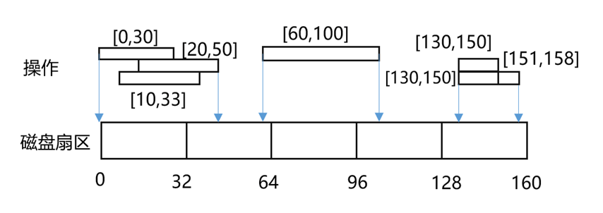

**输入**

第一个参数为扇区大小 `sectorSize`，32 <= sectorSize <= 2048，且sectorSize为2的幂
第二个参数为操作列表 `opArray`，0 <= opArray.length <= 10000，0 <= opArray[i].startAddr <= opArray[i].endAddr < 2^31

**输出**

合并后的区间列表。**注意**：用例保证输出的列表大小 <= 10000

**样例****1**

输入：

```
32
[[0, 30], [10, 33], [130, 150], [151, 158], [60, 100], [130, 150], [20, 50]]
```

输出：

```
[[0, 31], [32, 50], [60, 63], [64, 95], [96, 100], [130, 158]]
```

解释：

参考上图。
对地址区间进行合并后为 [0, 50], [60, 100], [130, 158]； 注意：[130, 150] 有两次操作。
然后按照扇区大小拆分到每个扇区上，如 [60,100] 拆分到3个扇区上，为[60, 63], [64, 95], [96, 100]；
其他依次类推。

**样例****2**

输入：

```
64
[[77, 128], [130, 130], [2147483502, 2147483632], [2147483600,  2147483647]]
```

输出：

```
[[77, 127], [128, 128], [130, 130], [2147483502, 2147483519], [2147483520, 2147483583], 
[2147483584, 2147483647]]
```


**2.  题目分析**

**题目理解：**

本题可以分解为两个需求：

l 首先，区间合并。需要注意的是刚好相邻的区间合并成一个大的区间。

l 其次，区间再按扇区大小拆分。注意区间跨多个扇区的场景。

**思路解析：**

该题考察区间合并解法，在20211022力扣认证场次也有类似题目[实验室预约系统设计] https://3ms.huawei.com/km/groups/3803117/blogs/details/11204191，其中的一个解法是“打点标记法”，该解法的前提是数据规模不大。本题由于数据规模较大（opArray[i].startAddr <= opArray[i].endAddr < 2^31），参考示例2，如果采用打点方法，将会导致内存溢出，所以需采用区间合并方法。

解题可以分成以下三步：

l 第1步，首先对操作列表进行区间排序（优先按startAddr升序）；

l 第2步，其次区间合并，合并的一般方法为以当前区间的首地址和前一个区间的末尾地址进行比较，如下：

 *if (当前区间的首地址 大于 前一个区间的末尾地址 + 1) {  //既不重叠也不相邻*

  *记录一个新区间*

 *} else { // 有重叠或相邻*

  *将当前区间和前一个区间合并，即刷新前一个区间的末尾地址*

 *}*

注意：需考虑恰好相邻的场景，如示例1中的 [130, 150], [151, 158] 两个区间就是相邻的区间，合并后为 [130, 158]。

l 第3步，最后进行拆分。根据区间的startAddr和endAddr计算跨越扇区的个数，然后进行换算。需注意首个扇区和末尾扇区的边界。


```python
from typing import List, Tuple

 

class Solution:

    def io_merge(self, sector_size: int, op_array: List[Tuple[int, int]]) -> List[Tuple[int, int]]:

        op_array.sort(key=lambda x: x[0])

        merged = []

        for start, end in op_array:

            if not merged or merged[-1][1] < start - 1:

                merged.append([start, end])

            else:

                merged[-1][1] = max(merged[-1][1], end)

        sectors = []

        for start, end in merged:

            while start <= end:

                next_end = min((start // sector_size + 1) * sector_size - 1, end)

                sectors.append([start, next_end])

                start = next_end + 1

        return sectors
```


------


#### ✅2023-09.08-1. 浏览器历史记录

http://oj.rnd.huawei.com/problems/3589/details

**题目描述**


打开一个浏览器，此浏览器窗口一般具备浏览历史的特性（如上图所示），请实现如下功能：

- `BrowserHistorySys(string homepage, int maxCount)` — 初始化。`homepage`作为**当前页**，并缓存到**浏览历史**中；浏览历史中最多缓存`maxCount`个网页。

- `visit(string url)` — **跳转访问**页面`url`，返回访问后浏览历史中的缓存页面数量。

  - 如果入参 url 仍是当前页，则继续浏览此页面，即：当前页不变，且浏览历史也不变；

  - 如果入参 url 不是当前页，则跳转到此 url，并把此 url 页面作为当前页； 同时清除浏览历史中原当前页的**前进记录**，再将此 url 缓存到浏览历史中。示意如图：

    

    

    

    当前页为：google.com，此时跳转访问mails.huawei.com，则：
    \- 清除前进记录
    \- 跳转访问 mails.huawei.com
    \- 当前页变为 mails.huawei.com
    \- 最新当前页进入缓存浏览历史

    

  - 如果新增缓存后，浏览历史缓存页面数量超过 maxCount, 则清除浏览历史中最早的记录。

    

- `back()` — 在浏览历史中从当前页**后退**一步，返回停留页面的 url，并作为当前页。

  - 注：如果已退无可退，则不再后退，继续停留在当前页。

- `forward()` — 在浏览历史中从当前页**前进**一步，返回停留页面的 url，并作为当前页。

  - 注：如果已进无可进，则不再前进，继续停留在当前页。

**解答要求**时间限制：1000ms, 内存限制：256MB

**输入**

每行表示一个函数调用，初始化函数仅首行调用一次，累计函数调用不超过 100 次。

> homepage、url的合法集合为[0-9a-z./]，即：小写字母，数字，点和斜线。输入保证合法。
> 8 <= homepage.length, url.length < 32, 0 < maxCount < 20

**输出**

输出每个命令的执行结果

**样例**

输入样例 1 复制

```
BrowserHistorySys("w3.huawei.com", 10)
visit("google.com")
back()
forward()
forward()
visit("baidu.com")
visit("youtube.com")
back()
visit("baidu.com")
back()
visit("mails.huawei.com")
```

输出样例 1

```
null
2
"w3.huawei.com"
"google.com"
"google.com"
3
4
"baidu.com"
4
"google.com"
3
```

提示样例 1

首次操作—初始化：当前页为 “w3.huawei.com”，缓存为 [“w3.huawei.com”]，容量10
第二次操作 = visit(…)：缓存为[“w3.huawei.com”, “google.com”]，数量为 2，当前页是 “google.com”，注：无前进记录可清理
第三次操作 = back()，当前页面回到 “w3.huawei.com”
第四次操作 = forward()：当前页面又到 “google.com”
第五次操作 = forward()，进无可进，当前页仍停留在 “google.com”
第六次操作 = visit(…)：缓存变为[“w3.huawei.com”, “google.com”,”baidu.com”]，当前页为”baidu.com”
第七次操作 = visit(…)：缓存变为[“w3.huawei.com”, “google.com”,”baidu.com”,”youtube.com”]，并把当前页置为 “youtube.com”
第八次操作 = back()，当前页变为 “baidu.com”
第九次操作 = visit(…)：url和当前页相同，缓存和当前页都保持不变
第十次操作 = back(), 当前页变为”google.com”
最后操作 = visit(…)：url和当前页不同，如题干图所示

输入样例 2 复制

```
BrowserHistorySys("www.huawei.com", 3)
visit("w3.huawei.com")
visit("w4.huawei.com")
back()
visit("www.huawei.com")
visit("w5.huawei.com")
visit("w6.huawei.com")
```

输出样例 2

```
null
2
3
"w3.huawei.com"
3
3
3
```

提示样例 2

首次操作：初始化
第二次操作 = visit(…)：操作后缓存为 [www.huawei.com, w3.huawei.com]
…
第五次操作 = visit(…)：操作后缓存为 [www.huawei.com, w3.huawei.com, www.huawei.com]
第六次操作 = visit(…)：操作后缓存为 [w3.huawei.com, www.huawei.com, w5.huawei.com]，当前页面是：w5.huawei.com，注：超过缓存容量上限时，首个www.huawei.com最早，优先删除
第七次操作 = visit(…)：，缓存为 [www.huawei.com, w5.huawei.com, w6.huawei.com]，当前页面为 w6.huawei.com。注：超过缓存容量上限时，w3为当前更早，优先删除


------


#### ✅2023-08.11-1. 双遥控电路

https://3ms.huawei.com/km/groups/3803117/blogs/details/14650115?l=zh-cn

实验室对一个设备进行通断测试，实验员可以操控开关进行通断，有两种情况：
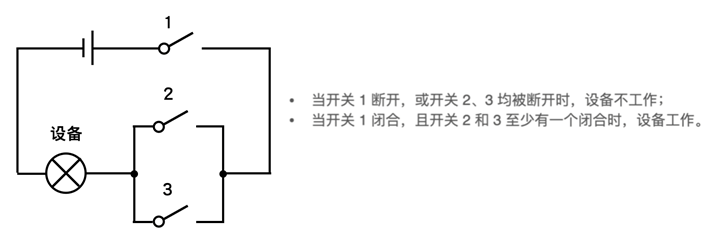

初始时，3个开关的状态均为断开；现给定实验员操控记录的数组 records ，records[i] = [time, switchId]，表示在时刻 time 更改了开关 switchId 的状态。

开关 switchId 仅为 1、2、3，状态是**从断开变成闭合**、或**从闭合变成断开**。

测试中为了避免设备过热，若开关在时刻 time 闭合，且在 [time, time + limit) 区间内未接收到指令，则：

·     在时刻 time + limit 该开关自动变为断开；若**此时恰好**收到指令，则该开关再次变为闭合。

请返回完成最后一次操作、且所有开关状态变为断开后，设备的累计工作时长。

**示例** **1：**

输入：
records = [[0,1],[1,3],[2,2],[3,3],[4,1],[4,3]]
limit = 3

输出：5

解释：如下图所示，
在时刻 0 更改开关1，开关1切换到闭合，此时设备未工作；
在时刻 1 更改开关3，开关3切换到闭合，此时设备工作；
在时刻 2 更改开关2，开关2切换到闭合，此时设备工作；
在时刻 3 更改开关3，开关3切换到断开，虽然开关2 状态为闭合，但是开关1已自动断开，所以此时设备开始不工作；
在时刻 4 更改开关 1、3，开关1、3切换到闭合，此时设备工作；
在时刻 5，开关 2 自动断开；
在时刻 7，开关 1、3 自动断开，此后设备不再工作；
因此在 [1, 3) 和 [4, 7) 的时间段中，设备工作，返回 (3 - 1) + (7 - 4) = 5。
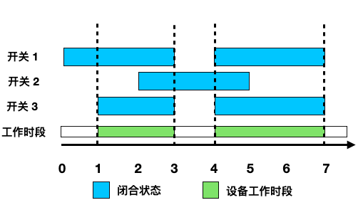

**示例** **2****：**

输入：
records = [[3,3],[4,1],[5,2],[6,1],[7,3],[8,1],[11,3]]
limit = 4

输出：6

解释：如下图所示，其中：
在时刻 7，开关 3 自动断开，但此时恰好收到指令，开关 3 再次闭合；
在时刻 11，开关 3 自动断开，但此时恰好收到指令，开关 3 再次闭合；
最终，在 [4, 6) 和 [8, 12) 的时间段中，设备工作，返回 6。
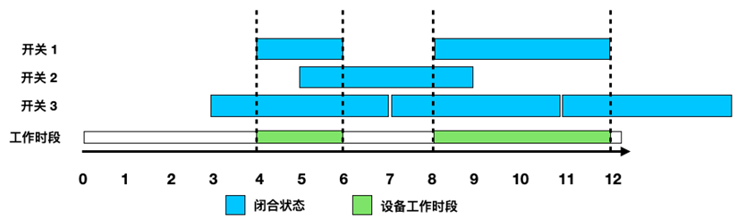

**提示：**

·     1 <= records.length <= 10^3

·     0 <= records[i][0] <= records[i+1][0] <= 10^3

·     1 <= limit <= 10^3

·     records[i][1]仅包含 1,2,3

·     用例保证同一时刻对同一开关只有一次操作


**2.  题目分析**

**题目理解：**

题目要求根据实验员操控记录和设备的限制时间，计算设备的累计工作时长。实验员可以通过操控开关改变开关的状态，开关状态从断开变成闭合或从闭合变成断开。如果一个开关在闭合状态下、在limit时间内没有接收到指令，则该开关会自动变为断开状态。

需要注意的是，如果在开关自动断开瞬间恰好收到操作指令，开关会再次变为闭合状态。

**思路解析：**

Ø 打点法，每单位时间递增，判断每一单位时间开关状态

要想得到设备的累计工作时长，就要知道设备每个时间点是否在工作。

我们已经知道每个操作指令在什么时刻操作了哪个开关，每个开关打开后如果没有新的指令操作它，那么它将工作limit时长。

所以，我们可以考虑用打点的方法，将每个时间段对应的开关状态全部标记出来，结合示例1的数据图示如下：

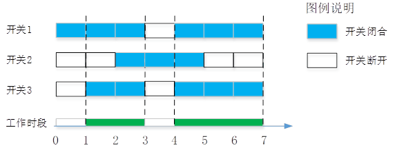

用二维数组记录三个开关在每个时间点的通断状态。

每当闭合一个开关SWx时，我们就对这个开关的[time, time+limit)这段时间打点标记为1，表明这段时间开关SWx处于闭合状态，其它情况标记为0。

然后，从时刻0开始遍历所有时间点，在每个时间点如果 SW1 && (SW2 || SW3) 为1，则说明这个时间段设备处于工作状态。

最后，累加所有工作时段就是设备的总工作时长。

Ø 遍历records，按每次操作的时间递进

因为每个操作指令都会更改一个开关的状态，所以我们可以在每个操作时刻，计算设备的工作时长。

注意到题目 0 <= records[i][0] <= records[i+1][0] <= 10^3 说明操作时间是升序，所以在每个操作时间点上不用管理太久的时间段、只需要计算两次操作之间的工作时长，这样迭代下去就能够求到设备的累计工作时长。

如下图下半部所示，我们在每一个操作时刻画一个泳道，泳道长度表示这个时间段设备的工作时长：

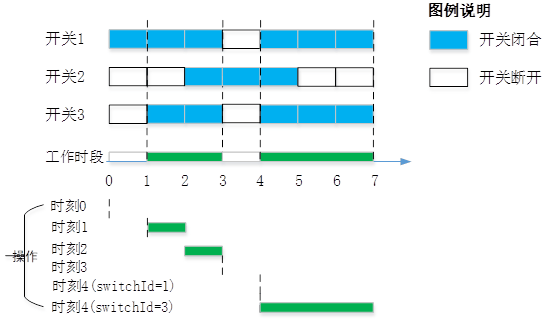

在每次操作的时候（时刻=time、开关=switchId），开关1、2、3能够向右起作用的结束时刻设为time1、time2、time3，三个时刻再分别与下一个操作时刻取最小值（本次只处理截止到下一个操作时刻这段时间）。

设当前时刻time为左指针，则右指针=min(time1, max(time2, time3))

左右指针形成的窗口大小就是本次操作距离下一次操作之间设备的工作时段。

```python
class Solution:

    def control_circuit(self, records: List[List[int]], limit: int) -> int:

        flag = [[], [], []]

        for pre_time, switch_id in records:

            if pre_time not in flag[switch_id - 1]:

                for j in range(limit):

                    flag[switch_id - 1].append(pre_time + j)

            else:

                while pre_time in flag[switch_id - 1]:

                    flag[switch_id - 1].pop()

        together_time = set(flag[0]) & (set(flag[1]) | set(flag[2]))

        count = len(together_time)

        return count
```

该解法没有每单位时间递增，而是遍历records、按每次操作的时间递进。

Ø 创建一个名为flag的列表，其中包含三个空列表。这些列表用于存储每个开关的工作时间记录。

Ø 对于给定的records列表中的每个记录，记录包含两个值：pre_time（工作时间）和switch_id（开关ID）。

Ø 如果pre_time不在flag[switch_id - 1]列表中，表示该开关在该时间点之前没有工作过。在这种情况下，将pre_time加上0到limit-1的范围内的值，并将这些值添加到flag[switch_id - 1]列表中。

Ø 如果pre_time在flag[switch_id - 1]列表中，表示该开关在该时间点之前已经工作过。在这种情况下，从flag[switch_id - 1]列表中删除pre_time。

Ø 最后，计算同时工作的时间，即同时在开关1、开关2和开关3上工作的时间。使用集合操作符 & 和 | 来计算这些时间的交集和并集。

Ø 计算交集together_time的长度，即设备的累计工作时长。

代码简洁，易于理解。使用集合操作符来计算交集和并集，提高了代码的效率。


------


#### ✅2023-07.14-1. 容器资源分配

http://oj.rnd.huawei.com/problems/3569/details

**题目描述**

容器化是当前云化趋势下的一种重要技术，容器运行需要足够的CPU资源，请实现一种CPU分配机制，满足如下设计要求：
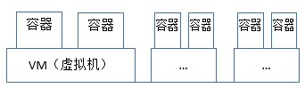

- 假设所有虚拟机的 CPU核数都为 `cpuCore` 。
- 为了满足可靠性要求，每个虚拟机上**最多部署 2 个**容器；一个容器占用一定数量的 CPU 核数，一个虚拟机上容器占用的CPU核数总和不能超过 `cpuCore` 。

现有 A、B 两个业务，每个业务都有一个或多个微服务，每个微服务独占一个容器：

- 承载业务A 的每个容器需要的CPU核数记录于 `serviceA` 中，serviceA.length 为容器数量，serviceA[i] 表示容器 i 所需的CPU核数。业务B 的信息 `serviceB` 含义同理。
- **业务A 需要支持反亲和策略**，即业务A 的任意两个容器不能运行在同一个虚拟机上；**业务B 不需要反亲和**。

请计算**最少**需要多少个虚拟机才能满足这两个业务的资源要求？

**解答要求**时间限制：800ms, 内存限制：256MB

**输入**

首行三个整数`cpuCore serviceA.length serviceB.length`
第二行是 serviceA
第三行是 serviceB

> 2 <= cpuCore <= 1000
> 1 <= serviceA.length, serviceB.length <= 10^5, 1 <= serviceA[i], serviceB[i] <= cpuCore

**输出**

一个整数，表示最少需要多少个虚拟机

**样例**

输入样例 1 复制

```
32 3 2
16 8 16
2 7
```

输出样例 1

```
3
```

提示样例 1

- 每个虚拟机的CPU核数固定为 32， 业务A 的 3 个容器的CPU核数需求为 16、8、16，业务B 的 2 个容器的CPU核数需求为 2、7 。
- 由于A业务的反亲和要求，需要虚拟机的数量至少和A业务容器数相同，即 3 个；其中一种利用 3 个虚拟机满足CPU资源需求的分配方案为：
  虚拟机1：(A:16，B:2)
  虚拟机2：(A:8，B:7)
  虚拟机3：(A:16)

> 注意：每个虚拟机最多部署2个容器

输入样例 2 复制

```
64 3 5
32 8 16
32 16 54 16 16
```

输出样例 2

```
4
```

提示样例 2

最少需要 4 个虚拟机。可以有多个分配方案，其中之一：
虚拟机1：(A:32，B:32)
虚拟机2：(A:8，B:54)
虚拟机3：(A:16，B:16)
虚拟机4：(B:16，B:16)


2. **题目分析**

**题目理解：**

题目是一个资源分配问题，即如何使用最少的虚拟机（VM）来满足两种服务（serviceA和serviceB）的CPU需求。所有虚拟机有一个固定的CPU核心数（cpuCore），每种服务都有一系列的CPU需求。如果两种服务需要的CPU核数之和不超过一个虚拟机的CPU核心数，那么这两种服务可以在同一个虚拟机上运行。

l 每个虚拟机上最多部署 2 个容器。

l 反亲和策略指的是业务A 的任意两个容器不能运行在同一个虚拟机上，即每个虚拟机上的业务组合可能是 AB、BB、A、B 四种情况，不能是AA。

这意味着任意一个serviceA[i]都需要单独占用一个虚拟机，而serviceB[j]可以和serviceA[i]拼一个虚拟机。

所以可以推断出，最后需要的虚拟机数量必定大于等于serviceA的长度的。

 

**思路解析：**

1) 计算量的估计

如果用两层循环的方法，将serviceB[j]和serviceA[i]拼一个虚拟机，拼成功后删除serviceB[j]；剩余的serviceB两两组合为一个虚拟机。

注意到 serviceA 和 serviceB 的数据规模都是10^5，两层循环暴力遍历的计算量是10^10（100亿），会超时。

解决问题的关键是如何减少计算量？

既然每个serviceA[i]都需要单独在一个虚拟机内，那么即使需要的CPU核数为1，也需要分配一个独立的虚拟机。

所以，我们可以用贪心的思想，优先将serviceA需要的虚拟机分配好，再去分配serviceB。要想尽量不浪费虚拟机的资源，需要把serviceB中CPU核数多的先用掉。于是，我们对serviceA升序、对serviceB降序排列，以样例2的数据为例，如下图所示：

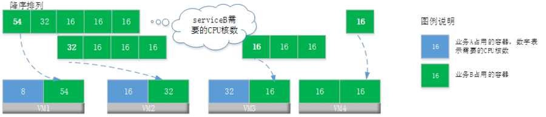

每当匹配一对，就从serviceB删除匹配到的元素。注意这个时候，我们从serviceB找位置的时候，不能采用循环遍历的方式，而是要采用更高效的查找方法。

2) 二分查找

serviceA[i]先占据一个容器，现在问题就变为如何高效从serviceB中找到一个位置j，使得serviceA[i]+serviceB[j]最接近于cpuCore的值搭配为一对。

既然serviceB已经有序，我们可以用二分查找法，从serviceB找到小于等于cpuCore - serviceA[i]的最小位置。

这样，总的时间复杂度为O(nlogn)=10^5*17，大约170万的计算量。

3) 优先队列

既然需要serviceA升序、serviceB降序，而且需要从队列中增删节点，所以可以考虑用优先队列。

serviceA用小顶堆、serviceB用大顶堆，每次从队首弹出两个节点尝试组成一对：

l 如果成功，计数加1，并且从队首弹出节点

l 如果不能成功，则将大顶堆队首节点弹出后加入到小顶堆中

最后加上小顶堆的剩余长度就是最终结果。总的时间复杂度也是O(nlogn)。

4) 双指针

首先对serviceA和serviceB升序排序，从最小的serviceA和最大的serviceB开始，尝试将它们配对。如果它们的和不超过cpuCore，那么就可以在同一个虚拟机上运行；对于剩余的serviceB，从最小和最大开始，尝试将它们配对。如下图所示：


即一个指针指向serviceA，另外一个指针指向serviceB。

双指针解法，排序的时间复杂度是O(nlogn)、遍历的时间复杂度是O(n)，总的时间复杂度也是O(nlogn)。

```python

```


------


#### ✅2023-06.16-1. 单词匹配2

http://3ms.huawei.com/km/groups/3803117/blogs/details/14340275

**题目描述**

在一个字符矩阵中，可把横向或竖向**连续相邻**的字符、按顺序组成一个单词，例如下图所示的 XE、ACX、STJIIE


给定一个字符矩阵 charMatrix 和目标单词列表 words，请计算这个字符矩阵可以组成多少个 words 中的单词，并返回这个数量：

- 矩阵中每个格子的字符，对于同一个单词不能重复使用；在不同的单词之间可以重复使用。
- 格子字符为 `?` 表示通配符，可以匹配**任一字母**。

**解答要求**时间限制：1000ms, 内存限制：256MB

**输入**

首行两个整数 rows 和 cols，1 <= rows, cols <= 5
随后 rows 行，每行有 cols 个字符，表示给定的字符矩阵，字符矩阵仅由大写字母或字符`?`组成
最后两行输入单词数量及单词列表 words，单词仅由大写字母组成，且单词不重复，1 <= words.length <= 100，1 <= words[i].length <= 8

**输出**

一个整数，表示字符矩阵可以组成 words 中的单词数量

**样例**

输入样例 1 复制

```
3 4
ACEI
EX?I
SSTJ
8
ACX II STJIIE XE NXE ACA ACECTJ ACETJ
```

输出样例 1

```
6
```

提示样例 1

ACX, II, STJIIE, XE 这四个单词可由矩阵中连续相邻格子的字符组成。
利用通配符后，单词 NXE 可由矩阵中 ?XE 组成； 同理 ACECTJ 也可组成。
但 ACA 和 ACETJ 无法组成。

输入样例 2 复制

```
5 5
A?JFL
J?ASD
DG?OI
G??GB
A?OFC
7
A AA AAA AAAAAAAA ADJAS ADJAJDA LDSFL
```

输出样例 2

```
6
```

提示样例 2

只有 LDSFL 无法组成


------

#### ✅2023-06.09-2 至多交换一次的测试时间

http://3ms.huawei.com/km/groups/3803117/blogs/details/14300413?l=zh-cn

有一批指示灯，放在**正方形**的测试仪器 board 中进行测试。 board[i][j] 表示仪器第 i 行 j 列位置上指示灯的型号。

现进行测试，仪器依次接收 nums 中的数字，规则如下：

l 每接收一个数字， board 中所有型号值等于该数字的指示灯都会点亮；

l 当 board 有任意一行或一列被完全点亮时，表示仪器测试完成；

l 有 1 次交换 board 中任意两盏指示灯的机会（也可以不使用）。

请问仪器**最早**能在接收第几个数字（从 1 开始计数）时完成测试？

**示例** **1****：**

输入：
nums = [6,2,2,1,7,5,7,3,4]
board = [[4,1,3],[1,2,5],[7,6,2]]

输出: 2

解释：
如下图所示方案，交换 board 中 2和7的位置，即可在接收完 nums[1] = 2 时完整点亮 board 的最后一行。
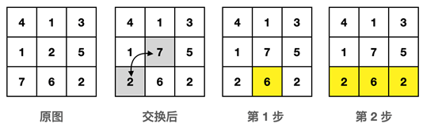
如下交换方案也是在接收完第 2 个数字时完成：
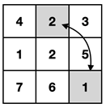

假设不交换，在接收完 nums[1] 数字后，board的最后一行和中间一列只差一盏灯未点亮，因此只要交换一盏灯，即可在第 2 步完成。

**示例** **2****：**

输入：
nums = [8,9,2,7,10,1,1,1,4,5,5,3]
board = [[5,9,5,1],[1,4,2,8],[2,8,1,3],[3,1,7,2]]

输出: 6

解释：
其中一种方案如下图所示：
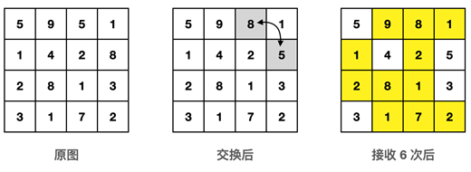

**示例** **3****：**

输入：
nums = [1,2,3,4,5,6,7,8,9]
board = [[7,1,2,8],[4,8,6,3],[9,2,1,7],[4,7,6,5]]

输出: 6

解释：不需要交换任何指示灯的位置。

**提示：**

l 2 <= board.length == board[i].length <= 300，board 中的数字可能重复，且每个数字的重复个数不超过 100

l 1 <= nums.length <= 10^5, 1 <= nums[i] <= 10^5，nums 中的数字可能重复

l board 中的所有数字在 nums 中都存在，nums 中的数字在 board 中不一定存在

l 温馨提醒：暴力解法通过用例不多，请考虑高效的解法


2. **题目分析**

**题目理解：**

测试仪器由 n * n 的正方形格子组成，每个格子上的数字表示一盏灯的型号；现从一位数组 nums 中逐个接收数字，当灯的型号等于 nums[i] 时，指示灯会点亮。

求最早能在接收第几个数字（从 1 开始计数）时完成测试。

完成测试的条件是：有任意一行或一列被完全点亮时，表示仪器测试完成

注意：

l 同样的数字可能在多个格子中重复

l nums[i]和nums[j]可能相同

l 有 1 次交换 board 中任意两盏指示灯的机会（也可以不使用）：可以提前交换，也可以点亮灯过程中交换，交换本身不占用步数

l 题目说了“`board` 中的所有数字在 `nums` 中都存在”，即一定有解。

**思路解析：**

因为不知道接收第几个数字后可以完成测试，所以对nums数组进行一次遍历是少不了的。

为了方便分析时间复杂度，我们设nums的长度为m，board的边长为n。

如果每接收一个数字后，都暴力遍历所有的行和列，则时间复杂度最高可能达到 m*n^3=2.7万亿，会超时。

我们需要分析计算量，不要用暴力方法去求解。

1) 对board中的每个数字作哈希，记录数字对应的格子位置，减少计算量

以示例1为例，每个数字对应的行列位置如下表所示：

| 数字 | 对应的行列位置 |
| ---- | -------------- |
| 1    | (0,1)、(1,0)   |
| 2    | (1,1)、(2,2)   |
| 3    | (0,2)          |
| 4    | (0,0)          |
| 5    | (1,2)          |
| 6    | (2,1)          |
| 7    | (2,0)          |

这样，每当我们接收到一个数字后，就不需要遍历所有格子，而只需要遍历数字对应的行列位置。

两种极端情况：

l 所有灯的数字都相同，这个时候只要接受到这个数字后，遍历n*n的格子后就可以完成测试，时间复杂度为*O*(n^2)

l 所有灯的数字都不相同，这个时候每个数字对应的位置只有1个，可能需要遍历完整个nums数组，时间复杂度为*O*(m)

寻找影响到的格子的时间复杂度，就从*O*(n^2)减小到*O*(1)

接下来，我们就需要思考如何高效判断一行一列全部被点亮，同时利用好交换 board 中任意两盏指示灯的机会。

2) 记录每一行、每一列已经点亮的灯的数目

我们已经根据输入数字快速找到对应的格子位置，但接下来如果我们用两层循环判断哪一行、哪一列完成测试，则时间复杂度至少都是m*n^2=90亿，会超时。既然我们已经知道nums[i]影响的行和列了，我们就可以直接判断对应行或者列已点亮的灯的数量，于是我们需要用数组记录每一行、每一列已点亮的灯的数量。

判断某一行、某一列点亮灯的数量的时间复杂度，可以从O(n)减小到O(1)

3) 如何利用好交换 board 中任意两盏指示灯的机会

我们可以思考一下，用或者不用这个交换机会有什么不同？思考之后，我们可以发现完成测试有两种情况：

l 某一行或者某一列， 所有灯都亮了。

l 某一行或者某一列，还差一盏灯， 其他行或列的位置还有亮的灯，我们就可以替换了并终止。

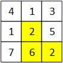

如上图所示，当示例1中已经接收到两个数字（分别是6和2）后，第2行（最底下那行）已点亮的灯数为2，但是总的亮灯数为3，此时我们把这个交换机会用掉就可以完成测试。所以，我们这样利用交换机会：

l 当某行或某列已点亮的灯数为 n-1时，如果此时总的亮灯数大于等于n，那么交换后这行或这列所有灯将全部被点亮。

 

n^2等于9万，m等于10万，两者取较大值，所以最优的时间复杂度是*O*(m)。


```python
import collections
from typing import List


class Solution:
    def earliest_completed_test(self, nums: List[int], board: List[List[int]]) -> int:

        len_nums, len_board = len(nums), len(board)
        number_loc = collections.defaultdict(list)

        for i in range(len_board):
            for j in range(len_board):
                number_loc[board[i][j]].append((i, j))

        number_to_light_row, number_to_light_col = [len_board] * len_board, [len_board] * len_board

        total_light = 0
        res = 1
        for num in nums:
            if number_loc.get(num):
                for x, y in number_loc[num]:

                    number_to_light_row[x] -= 1
                    number_to_light_col[y] -= 1

                    total_light += 1
                    if number_to_light_row[x] == 0 or number_to_light_row[y] == 0:
                        return res
                    if number_to_light_row[x] == 1 or number_to_light_col[y] == 1 and total_light >= len_nums:
                        return res

            number_loc[num].clear()
            res += 1

        return -1


# nums = [6, 2, 2, 1, 7, 5, 7, 3, 4]
# board = [[4, 1, 3], [1, 2, 5], [7, 6, 2]]
nums = [1, 2, 3, 4, 5, 6, 7, 8, 9]
board = [[7, 1, 2, 8], [4, 8, 6, 3], [9, 2, 1, 7], [4, 7, 6, 5]]
print(Solution().earliest_completed_test(nums, board))
```

该解法用dict记录每个数字对应的位置信息。

Ø 首先通过函数 init_num_to_loc 将 board 中每个数字对应的位置记录下来，存储在一个字典 num_to_loc 中。

Ø 然后通过函数 init_row_col 初始化两个列表 row_n 和 col_n，分别表示每行和每列未点亮的灯数，初始值都为n。

Ø 接着遍历 nums 列表中的每个数字：

l 找到它在网格中的位置，更新 row_n 和 col_n 列表中对应行和列的数字个数，并判断该行或该列是否已经填满，如果是，则返回当前步数 t。

l 如果该行或该列还差一个数字就能点亮所有灯，将 exist 标记为 True，意思是下一步就可以完成测试。

l 如果 exist 为 True，且已经点亮的灯数 total 大于等于 bn，则返回当前步数 t。

l 最后将 num_to_loc 中该数字对应的位置清空，步数 t 加 1。

代码简洁易懂，时间复杂度为 *O*(m)。


------

#### ✅2022-05.12-2  简易文件读写

http://3ms.huawei.com/km/groups/3803117/blogs/details/14121355?l=zh-cn

请实现一个简易的文本文件读写系统，提供如下文件操作功能：

·     `TextFileSys()` -- 系统初始化，此时无任何文件

·     `open(string filename, string mode)` -- 打开或新建文件。打开模式 mode 仅为 r 、 r+ 、w 、w+ 、a 、a+ ：

o  文件 filename 不存在：仅当 mode 为 r 或 r+ 时失败，其它模式下会新建此文件并打开成功。

o  文件 filename 已存在：处于未打开状态时，打开成功；处于已打开状态时，打开失败。

成功打开后，按下表处理，并返回 0； 失败返回 -1 。

| **内容处理规则**           | r    | r+   | w    | w+   | a    | a+   |
| -------------------------- | ---- | ---- | ---- | ---- | ---- | ---- |
| 打开时是否清空内容         | n    | n    | y    | y    | n    | n    |
| 打开时位置指示器的初始位置 | 开头 | 开头 | 末尾 | 末尾 | 末尾 | 末尾 |
| 打开后是否可读             | y    | y    | n    | y    | n    | y    |
| 打开后是否可写             | n    | y    | y    | y    | y    | y    |

·     `close(string filename)` -- 关闭文件 filename

o  若文件处于打开状态，则关闭该文件、并返回 0； 否则，返回 -1 。

·     `write(string filename, string content)` -- 往文件 filename 中写入内容 content

o  若文件处于打开状态且可写，则按照「内容处理规则」，在位置指示器的当前位置写入content内容，返回写入后文件内容的长度；否则，返回 -1 。

o  写入后，位置指示器移动到本次写入内容的末尾。

·     `readAll(string filename)` -- 读出文件 filename 中的全部内容

o  若文件处于打开状态且可读，则按照「内容处理规则」，读出文件全部内容并返回；当内容为空时，返回字符串`null`；否则，返回字符串 `error` 。

o  readAll 操作不改变位置指示器。

r: 以只读方式打开已存在的文件; r+: 以读写方式打开一个已存在的文件。
w: 以只写方式打开或新建一个文件。 w+: 以读写方式打开或新建一个文件。
a：以追加方式打开或新建一个文件，用于写。 a+: 以追加方式打开或新建一个文件，用于读写。

输入

首行一个整数 num，表示文件操作的个数，1 <= num <= 100
接下来 num 行，每行一个文件操作，格式为 `操作``=``参数``1 ``参数``2 …`

filename 仅为字母和数字，1 <= filename.length <= 10
content 仅为不含空格的可见字符，1 <= content.length <= 10

输出

逐行输出这 num 个操作的返回值

样例1

输入：

```
7
TextFileSys
open=file1 w
open=file2 a
write=file1 engineer
close=file1
readAll=file1
readAll=file2
```

输出：

```
null
0
0
8
0
error
error
```

解释：

第四条命令 write=file1 engineer，往文件file1 写入内容 engineer，返回写入后文件内容长度 8 。
第六条命令 readAll=file1 执行时，file1已关闭，因此返回 error 。
第七条命令 readAll=file2 执行时，因为文件以 a 模式打开，不能读，返回 error

样例2

输入：

```
11
TextFileSys
open=f a
write=f hello
close=f
open=f w+
readAll=f
write=f how
close=f
open=f a+
write=f areyou
readAll=f
```

输出：

```
null
0
5
0
0
null
3
0
0
9
howareyou
```

解释：

第五条命令： w+ 模式打开文件后，内容被清空，因此第六条命令 readAll 返回字符串 null 。
第九条命令： a+ 模式打开后，位置指示器位于文件内容结尾；第十条命令，新写入内容追加在原内容后面。最后的命令 readAll，返回文件全部内容 howareyou

样例3

输入：

```
9
TextFileSys
open=f w+
write=f engineer
close=f
open=f r+
write=f hello
readAll=f
write=f world
readAll=f
```

输出：

```
null
0
8
0
0
8
helloeer
10
helloworld
```

解释：

r+ 模式打开后，位置指示器位于文件内容开头，新写入内容会从前往后覆盖内容，未被覆盖的内容保持不变：

·     write=f hello 写入后，已有内容从 engineer 变成 helloeer，指示器指向 o 后面的位置；

·     write=f world 再写入时，覆盖了 eer ，写入后最终变成 helloworld


**2.  题目分析**

**题目理解：**

该题要求程序模拟对文件的读写操作，与真实的文件系统操作类似，但不需要实际创建和读写文件。除构造函数外，一共有四个接口：

l 打开或新建文件

l 关闭文件

l 对某个文件写内容

l 读某个文件的所有内容

 

参考题目中的表格，需注意点如下：

1） open接口

a)   系统中一开始不存在任何文件，需要通过w 、w+ 、a 、a+四种模式之一来创建文件，后续才能对该文件进行读写操作；

b)   使用w 、w+两种模式打开文件时，会清空文件已经存在的内容；

c)   文件指示器在本题中主要是影响写数据内容的位置，注意使用“r+”模式打开时，可对文件进行写内容，且打开时未清空内容，并将文件指示器移到了开头；读数据内容不改变也不依赖文件指示器的位置。

2） write接口：文件指示器的位置不一定在末尾，写入时，从指示器位置开始写入内容，即：覆写已有内容、续写超出部分，而不是插入的方式写入，可参考示例3。

 

**思路解析：**

1） 设计建模：根据上面的题目理解，每个文件会涉及到文件名称、打开状态、读写标识、文件指示器的位置、文件内容，可以用一个单独的类/结构体保存；而文件管理系统，会操作多个文件，包含一个文件对象字典或列表。

 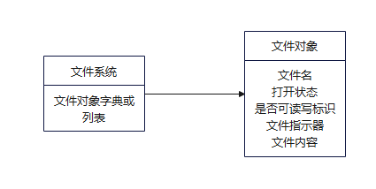

 

2） 实现方法：我们可以使用一个字典来存储文件对象，字典的键为文件名，值为一个元组（内容即上图文件对象中定义的属性）。

打开文件时，将新建的文件对象，按照不同模式初始化后，存储到字典中。

关闭文件时，只要刷新“打开状态”即可，不能在字典中删除。

读文件时，判断不是w或a模式，就读出文件的所有内容。

写文件时，需要注意文件指示器的当前位置，判断不是r模式，就写入内容。

```py
class File:
    def __init__(self, content, state, pos, read, write):
        self.content = content
        self.state = state
        self.pos = pos
        self.read = read
        self.write = write


class TextFileSys:

    def __init__(self):
        self.file_mgr = {}
        self.rule = {
            'r': [False, 'start', True, False],
            'r+': [False, 'start', True, True],
            'w': [True, 'end', False, True],
            'w+': [True, 'end', True, True],
            'a': [False, 'end', False, True],
            'a+': [False, 'end', True, True]
        }

    def open(self, filename: str, mode: str) -> int:
        if filename in self.file_mgr:
            cur_file = self.file_mgr.get(filename)
            if not cur_file.state:
                if self.rule[mode][0]: cur_file.content = ""  # 忘记判断这玩意了
                cur_file.state = True
                cur_file.pos = 0 if self.rule[mode][1] == 'start' else len(cur_file.content)
                cur_file.read, cur_file.write = self.rule[mode][2], self.rule[mode][3]

                return 0
            else:
                return -1
        else:
            if mode == 'r' or mode == 'r+':
                return -1
            else:
                content, pos = "", 0
                readble, writeable = self.rule[mode][2], self.rule[mode][3]
                self.file_mgr[filename] = File(content, True, pos, readble, writeable)
                return 0

    def close(self, filename: str) -> int:
        if self.file_mgr[filename].state:
            self.file_mgr[filename].state = False
            return 0
        else:
            return -1

    def write(self, filename: str, content: str) -> int:
        cur_file = self.file_mgr.get(filename)
        if cur_file and cur_file.state and cur_file.write:
            cur_str = cur_file.content[:cur_file.pos] + content
            len_cur_str = len(cur_str)
            cur_file.content = cur_str
            cur_file.pos = len_cur_str
            return len_cur_str

        else:
            return -1

    def read_all(self, filename: str) -> str:
        cur_file = self.file_mgr.get(filename)
        if cur_file and cur_file.read:
            return "null" if cur_file.content == '' else cur_file.content
        else:
            return "error"
```


#### ✅2022-04.14-2 文件目录权限管理系统

请你设计一个文件目录权限管理系统，实现以下功能：

- ·DirPermSystem(int[] path, int[] statuses) —— 初始化文件目录树及其初始状态o  
  - path[i] 下标表示目录编号，值表示其上一级目录的编号（根目录编号为 0，path[0]固定为 -1）。
  - statuses[i] 表示目录 i 的初始状态。仅两种：§ 
    - 1 表示「公开」状态，所有用户均可访问（无论是否授权）；
    - 2 表示「加密」状态，仅拥有权限的用户可访问；

- changeStatus(int dirId, int status) —— 修改目录 dirId 的状态为 status。（不涉及子目录）

-  grantRight(int userId, int dirId) —— 授予用户 userId 对目录 dirId 持有「目录树权限」。
  -  持有对 dirId 的「目录树权限」后，代表该用户可以访问 dirId 及其所有子目录（包含直接子目录、子目录的子目录等），即使**加密**的目录也可以访问。
  - **注意**：重复授予同一用户对目录 dirId 的「目录树权限」授权，只保留最后一次。

- removeRight(int userId, int dirId) —— 移除用户 userId 对目录 dirId 所持有的「目录树权限」。若授予过，则移除对这个目录的授权，并返回 true；否则不做处理，返回 false。

-  queryRight(int userId, int dirId) —— 查询用户 userId 是否可以访问目录 dirId，是返回 true；否则返回 false。

- queryNum(int userId) —— 查询用户 userId 所有可访问的目录数量。**注：** 输入用例保证函数中的 dirId 已存在。

```
示例 1：

输入：
["DirPermSystem","grantRight","changeStatus","queryRight","queryNum","removeRight"]
[[[-1,4,4,1,0],[1,1,2,1,1]],[101,1],[1,2],[101,3],[101],[101,1]]

输出：[null,null,null,true,4,true]

解释：
DirPermSystem sys = DirPermSystem([-1,4,4,1,0],[1,1,2,1,1]); // 初始化，目录结构示意：

0 (公开)

└ 4 (公开)

  ├ 1 (公开)

  │ └ 3 (公开)

  └ 2 (加密)

sys.grantRight(101,1); // 授予用户 101 对目录 1 的「目录树权限」，即可访问目录1、3
sys.changeStatus(1,2); // 目录 1 从「公开」状态修改为「加密」状态
sys.queryRight(101,3); // 目录 3 为「公开」，因此用户 101 可以进行访问，返回 true
sys.queryNum(101); // 目录 0、4、3 为「公开」状态，用户 101 可以访问；此外，用户有目录 1 的权限，所以返回 4
sys.removeRight(101,1); // 用户 101 有目录 1 的「目录树权限」；移除该权限，返回 true
注：输出中的 null 表示此对应函数无输出（其中：C 的构造函数有返回值，但是也是无需输出）


示例 2：

输入：
["DirPermSystem","grantRight","grantRight","changeStatus","grantRight","grantRight","queryNum","removeRight","queryRight","changeStatus","grantRight","removeRight","queryNum","grantRight","changeStatus","removeRight","queryNum","changeStatus","removeRight","queryNum"]
[[[-1,2,0,6,6,0,0,2,3],[2,1,2,2,2,1,1,2,1]],[105,6],[103,3],[8,2],[105,3],[103,6],[105],[101,6],[103,3],[6,2],[105,6],[103,6],[103],[105,2],[2,1],[105,3],[105],[6,2],[105,6],[105]]

输出：
[null,null,null,null,null,null,6,false,true,null,null,true,4,null,null,true,8,null,true,4]

解释：
DirPermSystem sys = DirPermSystem([-1,2,0,6,6,0,0,2,3],[2,1,2,2,2,1,1,2,1]); // 初始化

0 (加密)

├ 6 (公开)

│ ├ 3 (加密)

│ │ └ 8（公开）

│ └ 4 (加密)

├ 2 (加密)

│ ├ 1 (公开)

│ └ 7 (加密)

└ 5 (公开)

sys.grantRight(105,6); // 授予用户 105 对目录 6 的「目录树权限」，即可访问目录 6 及其子目录 3、8、4
sys.grantRight(103,3);
sys.changeStatus(8,2);
sys.grantRight(105,3);
sys.grantRight(103,6);
sys.queryNum(105); // 用户 105 可以访问目录6、3、8、4、1、5。返回 6
sys.removeRight(101,6); // 返回 false
sys.queryRight(103,3); // 返回 true
sys.changeStatus(6,2);
sys.grantRight(105,6);
sys.removeRight(103,6); // 返回 true
sys.queryNum(103); // 之前用户 103 被授予过目录 3 和 6 的「目录树权限」，虽然随后删除了目录 6 的「目录树权限」，但仍保留着对目录 3 的「目录树权限」，因此仍可访问目录 3 及其子目录8，加上「公开」状态的目录 1、5。所以返回 4
sys.grantRight(105,2);
sys.changeStatus(2,1);
sys.removeRight(105,3); // 返回 true
sys.queryNum(105); // 用户 105 仍保留着对目录 6 和 2 的「目录树权限」，可访问目录为 6、3、8、4、2、1、7，以及公开的目录 5，总共可以访问 8 个目录
sys.changeStatus(6,2);
sys.removeRight(105,6); // 返回 true
sys.queryNum(105); // 用户 105 对于目录 2、1、7 有访问权限，以及公开的目录 5，总共可以访问 4 个目录
注：输出中的 null 表示此对应函数无输出（其中：C 的构造函数有返回值，但是也是无需输出）

提示：

· 2 <= changeStatus,grantRight,removeRight,queryRight,queryNum 累计操作数 <= 10^3

· 0 <= path.length == statuses.length <= 1000

· -1 <= path[i] <= path.length - 1

· 0 <= dirId <= path.length - 1

· 1 <= statuses[i], status <= 2

· 0 <= userId <= 1000

· 用例保证目录的深度不超过 30
```


**题目理解：**

需要设计一个文件目录权限管理系统，支持以下功能：修改目录加密状态，授予用户目录树权限，移除用户目录树权限，查询用户是否有访问目录权限，查询用户可访问目录数量。

Ø 目录的访问权限和linux的目录权限管理不一样

对某个用户授予持有某目录的「目录树权限」，可以视作对这个目录配了一把“钥匙”，对同一个用户一个目录最多配一把“钥匙”。

有了这把“钥匙”后，此用户就有访问此目录及其子目录的能力，把这把“钥匙”拿走，能力则随之消失。

假设有如下三个目录，目录均为加密状态，层次如下：

7

├ 8

│ └ 9

假定某用户持有目录 7、8 的「目录树权限」，移除目录 7 的权限后，由于仍持有目录 8 的权限，所以可以访问目录 8 和 9。如下图所示：

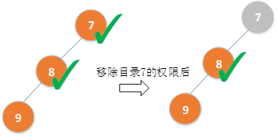

Ø 重复授予同一用户对目录 dirId 的「目录树权限」授权，只保留最后一次

对同一用户授予对目录7、目录8的「目录树权限」，这两个授权目录是独立且不同的。

只保留最后一次指的是同一个用户对同一个目录授权多次，只保留一次，举个例子：

假设对目录7授权了两次，然后删除授权一次，那么对于目录7也不存在授权了。

**思路解析：**

我们用节点表示目录，边表示目录之间的层级关系，如下图所示：


将对用户对目录的“授权”和判断用户“对某目录有访问权限”两个动作分开管理：

Ø 授权只管对目录增加授权、删除授权；

Ø 查询用户是否有访问目录权限时，如果目录状态是公开，可直接访问；如果是加密，有两个遍历方向：

l 从下往上，即从 dirId 开始往祖先目录迭代查找，如果某祖先目录授予过目录树权限，则说明此用户可以访问dirId

例如上图中从节点9向上查找，找到节点8的时候发现8被授权过，所以可以访问9。

这种做法，不需要记录每个节点的children节点，只需要记录每个节点的父节点。

l 从上往下，即从授予过目录树权限的目录开始，通过DFS/BFS往子目录遍历。如果子目录编号等于 dirId，说明此用户可以访问dirId

这种做法，就必须要记录每个节点的children节点。

 

因为目录编号是输入参数path的数组下标，必然是唯一的，并且目录编号不超过1000，所以可以使用整型数组statuses来记录每个目录的授权：下标为目录编号、值为授权状态。

可以定义一个TreeNode结构表示一个目录，也可以用数组记录目录的编号、父目录编号。

```python
import collections
from typing import List


class Node:
    def __init__(self, id):
        self.id = id
        self.status = 1
        self.child = []
        self.owner = []


class DirPermSystem:

    def __init__(self, path: List[int], statuses: List[int]):
        self.node_map = {}

        for idx, parent in enumerate(path):
            if idx not in self.node_map:
                curnode = Node(idx)
                self.node_map[idx] = curnode
            if parent not in self.node_map:
                parent_node = Node(parent)
                self.node_map[parent] = parent_node
            self.node_map[parent].child.append(self.node_map[idx])

        for i in range(len(statuses)):
            self.node_map[i].status = statuses[i]

    def change_status(self, dir_id: int, status: int) -> None:

        if dir_id in self.node_map:
            self.node_map[dir_id].status = status

    def grant_right(self, user_id: int, dir_id: int) -> None:

        if dir_id not in self.node_map:
            return

        queue = collections.deque()
        queue.append(self.node_map[dir_id])

        while queue:
            node = queue.popleft()
            node.owner.append(user_id)

            for child in node.child:
                queue.append(child)

    def remove_right(self, user_id: int, dir_id: int) -> bool:
        if user_id in self.node_map[dir_id].owner:
            self.node_map[dir_id].owner.remove(user_id)
            return True
        return False

    def query_right(self, user_id: int, dir_id: int) -> bool:

        if dir_id not in self.node_map:
            return False

        if self.node_map[dir_id].status == 1:
            return True
        elif self.node_map[dir_id].status == 2 and user_id in self.node_map[dir_id].owner:
            return True

        return False

    def query_num(self, user_id: int) -> int:

        res = []

        queue = collections.deque()
        queue.append(self.node_map[0])

        while queue:
            node = queue.popleft()

            if node.status == 1 or (node.status == 2 and user_id in node.owner):
                res.append(node)
            for child in node.child:
                if child:
                    queue.append(child)

        return len(res)


path = [-1, 4, 4, 1, 0]
statuses = [1, 1, 2, 1, 1]
obj = DirPermSystem(path, statuses)
print(obj.grant_right(101, 1))
print(obj.change_status(1, 2))
print(obj.query_right(101, 3))
print(obj.query_num(101))
print(obj.remove_right(101, 1))
```


#### 2023-03.10-3 死锁

http://3ms.huawei.com/km/groups/3803117/blogs/details/13789801?l=zh-cn

某系统的进程可能占有和等待一些资源，现给出在某一时刻dump的这些进程占有和等待的资源信息，请按照如下简化规则分析哪些进程发生了死锁，请**升序**返回所有死锁的进程ID列表，或空列表 []。
简化规则如下：

l 如果某个进程 *P* 的**任一**等待资源被占有，则该进程必须等待，直到这些资源被释放； 等待期间，该进程不会释放所占有的资源。

l 如果进程 *P* 所等待的资源全部都未被其他进程占有，则该进程**必将**释放所占有的资源。

基于上，如果某个进程因为所等待的资源一直被占有而无限等待下去，则认为该进程发生了死锁。

**输入**

第一行为一个整数num，表示进程个数；
第二行开始的num行，依次表示每个进程占有和等待资源的情况，格式为：`进程``ID (``占有资源列表``) (``等待资源列表``)`。

0 <= 进程ID <= 100, 0 <= 资源编号 <= 300
每一行的输入中不会包含重复的资源编号

输入保证：每个资源最多**只会**被一个进程占有。

**输出**

升序返回所有死锁的进程ID列表，或空列表 []

**样例****1**

输入：

5

100 () (20)

1 (40 20) (10)

2 (10) (30 100)

3 (100 300) (40 0)

0 () (30)

输出：

[1 2 3 100]

解释：

·     进程1 等待被进程2 占有的资源10；进程2 等待被进程3 占有的资源100；进程3 等待被进程1 占有的资源40。这三个进程，都因为所等待的资源一直被占有而无限等待下去，所以这三个进程都发生了死锁。

·     因为进程1 死锁，资源20 一直被占有，导致进程100 也死锁。

·     进程0 等待的资源30 未被占有，因此进程0 不死锁。

**样例****2**

输入：

4

2 () (40 30)

1 (20) (30 40)

3 () ()

9 (40) (30)

输出：

[]

解释：

对于每个进程，其所等待的资源全部都未被其他进程占有，不死锁。

样例3

输入：

6

1 (10) (20 50)

2 (20) (30 60)

3 (30) (40)

5 (50) ()

6 (101) (202)

7 (202) (101)

输出：

[6 7]


**题目理解：**

*死锁是指两个或多个进程（或线程）在执行过程中，因争夺资源而造成的一种互相等待的现象。*

死锁的定义：[https://zh.wikipedia.org/wiki/%E6%AD%BB%E9%94%81](https://zh.wikipedia.org/wiki/死锁)

此题的需求是对一组进程占有和等待资源情况进行死锁检测，判断是否存在死锁并输出死锁的进程ID列表。

一个进程发生死锁的条件是它所等待的资源一直被其他进程占有，而这些进程也在等待其他资源，最终导致多个进程处于互相等待状态，导致都无法继续执行。

以样例1为例，几个进程的死锁发生原因如下图所示：

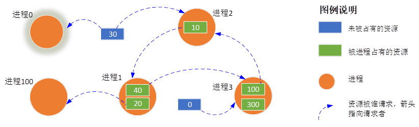

**思路解析：**

1) 模拟执行，从资源的角度来标记进程死锁

首先，统计所有进程占有的资源，全部标记为占有状态。

然后，通过循环检查每个进程，有两种情况：

l 如果进程A所请求的任一资源被占有了，则不释放进程A自己占有的资源

l 如果进程A所请求所有资源都没有被占有，则释放自己占有的所有资源

最后，再遍历每个进程，如果进程A所请求的任一资源被占有了，就可以判断进程A死锁了。

重复以上操作直到没有死锁进程。最后返回死锁进程的ID列表。

2) 使用图论中的拓扑排序算法来检测死锁

检测死锁的思路：

l 将所有等待资源的进程建立一个有向图，每个进程、每个资源都作为一个顶点（通过顶点ID区别是进程还是资源）

l 对于进程 P 中的每个请求资源 R，都在图中添加一条边从结点 R 指向结点 P

l 对于进程 P 占有的资源 R，都在图中添加了一条边从结点 P 指向结点 R

l 然后从入度为0的点开始，进行拓扑排序，将拓扑序列上的进程逐个删除，直到不存在没有等待资源的进程为止。如果最后还有进程存在，则说明这些进程形成了一个死锁。

3) 使用图论中的环路检测算法来检测死锁

使用深度优先搜索（DFS）来遍历每个进程等待的资源。如果进程A等待的某个资源被进程B占有了，则继续搜索进程B所占有的资源，以此类推，直到等待的资源已经被前面经过的节点占有了，即存在环路、发生了死锁。

同时，由于该进程占有的资源也一直被占有，因此它占有的所有资源对应的进程也都发生了死锁。

为了记录已经搜索过的资源和进程，可以使用一个集合来保存它们的编号。在搜索时：

l 如果发现要搜索的资源或进程已经在集合中了，则说明存在环路，搜索结束

l 如果搜索完成后没有发现任何环路，则不存在死锁。

```python
from typing import List

 

class Process():

    def __init__(self, processid, occupied, requested):

        self.processid = processid

        self.occupied = occupied

        self.requested = requested
        
        
class Solution:

    def deadlock_processes(self, processes: List[Process]) -> List[int]:

        # 创建等待资源

        resource_occupier = {}

        for process in processes:

            for resource in process.occupied:

                resource_occupier[resource] = process.processid

 

        # 创建字典等待资源过程

        waiting_processes = {}

        for process in processes:

            waiting_processes[process.processid] = set()

            for resource in process.requested:

                if resource in resource_occupier:

                    waiting_processes[process.processid].add(resource_occupier[resource])

 

        # 检测等待进程的id

        visited = set()

        rec_stack = set()

 

        def is_cyclic(process_id):

            visited.add(process_id)

            rec_stack.add(process_id)

 

            for next_process_id in waiting_processes[process_id]:

                if next_process_id not in visited:

                    if is_cyclic(next_process_id):

                        return True

                elif next_process_id in rec_stack:

                    return True

 

            rec_stack.remove(process_id)

            return False

 

        result = []

 

        for process in processes:

            if is_cyclic(process.processid):

                result.append(process.processid)

 

        return sorted(result)


if __name__ == "__main__":

    num = int(input().strip())

    processes = []

    for _ in range(num):

        line_data = input().strip().split(' (')

        processid = int(line_data[0])

        occupied = list(map(int, line_data[1][:-1].split()))

        requested = list(map(int, line_data[2][:-1].split()))

        processes.append(Process(processid, occupied, requested))

 

    function = Solution()

    results = function.deadlock_processes(processes)

    print("[" + str(str.join(" ", map(str, results))) + "]")
```

该解法使用深度优先搜索算法（DFS）遍历。

Ø 对于每个进程，首先遍历其占有的资源，建立一个字典，将每个资源与占有该资源的进程ID对应起来，即 resource_occupier。

Ø 创建一个字典waiting_processes，遍历每个进程，将每个进程等待的资源所属的进程ID添加到该进程对应的集合 waiting_processes[i] 中。

visited 和 rec_stack 分别表示已经访问过的节点和当前遍历路径上的节点。

递归函数 is_cyclic 接受一个进程ID作为参数，用于检测该进程process_id是否存在循环等待。

l 在该函数中，首先将当前进程标记为已访问，并将其加入递归栈中。

l 接着遍历该进程等待的所有进程waiting_processes[process_id]，如果下一个进程未被访问过，则递归调用 is_cyclic 函数。

l 否则，如果下一个进程已经在 rec_stack 中，则表示发生了环，返回 True。

l 如果遍历完所有等待进程后仍然没有发现环，则将当前节点从 rec_stack 中移除，并返回 False。

对于每个进程，调用is_cyclic函数进行检测，如果存在循环等待，则将该进程的id加入结果列表中。

visited 和 rec_stack都用set，这样判断效率比较高。

在用DFS遍历树、图等数据结构时，为了避免重复访问同一个节点，往往用一个visited变量（hash/map/set等类型）来判断重复。


#### ✅2023-02.10-1 二叉树构建

http://3ms.huawei.com/km/groups/3803117/blogs/details/13671425?l=zh-cn


请按下列描述构建一颗二叉树，并返回该树的根节点：
1、先创建值为 -1 的根结点，根节点在第 0 层；
2、然后根据 operations 依次添加节点： operations[i] = [height, index] 表示对第 height 层的第 index 个节点 node，添加值为 i 的子节点：

l 若 node 无「左子节点」，则添加左子节点；

l 若 node 有「左子节点」但无「右子节点」，则添加右子节点；

l 否则不作任何处理。

*height**、**index* *均从* *0* *开始计数；* *index* *指所在层的创建顺序。*

**注意：**

l 输入用例保证每次操作对应的节点已存在；

l 控制台输出的内容是根据返回的树根节点，按照层序遍历二叉树打印的结果。

**示例** **1****：**

输入：operations = [[0,0],[0,0],[1,1],[1,0],[0,0]]

输出：[-1,0,1,3,null,2]

解释：
先创建根结点，值为 -1
operations[0] = [0,0]: 选择第 0 层、第 0 个已创建的节点，即根节点（值为 -1），由于其无左子节点，因此添加左子节点 0 （节点值为下标 0 ）
operations[1] = [0,0]: 选择第 0 层、第 0 个已创建的节点，即根节点，由于已添加了左子节点，因此添加右子节点 1 （节点值为下标 1 ）
operations[2] = [1,1]: 选择第 1 层、第 1 个已创建的节点（值为 1），由于其无左子节点，因此添加左子节点 2
operations[3] = [1,0]: 选择第 1 层、第 0 个已创建的节点（值为 0），由于其无左子节点，因此添加左子节点 3
operations[4] = [0,0]: 选择第 0 层、第 0 个已创建的节点，即根节点，由于已存在左子节点和右子节点，因此不作任何处理
如图所示
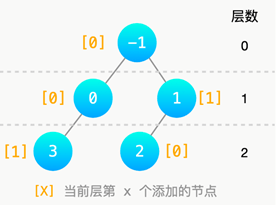

**示例** **2****：**

输入：operations = [[0,0],[1,0],[1,0],[2,1],[2,1],[2,1],[2,0],[3,1],[2,0]]

输出：[-1,0,null,1,2,6,8,3,4,null,null,null,null,null,null,7]

解释：
注意：operations[5]不做处理（注意不要覆盖已有节点）；
operations[7] = [3,1]，选择的是第 3 层创建顺序为 1 的节点（即值为 4），注意：不是按从左往右顺序选择。
第 4 层中的节点 7 比第 3 层中的节点 8 先添加，即不需要上一层都建完才能建下一层。
最终结果如图所示
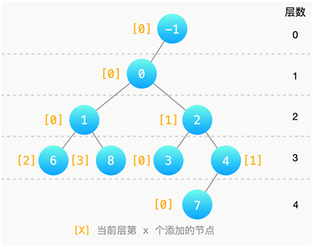

**提示：**

1 <= operations.length <= 100

operations[i].length == 2

0 <= operations[i][0] < 100

0 <= operations[i][1] < 100

示例输出说明：示例中的输出按照二叉树特殊层序方式输出各节点的值。

1. 首个值是根节点的值，也是返回值；
2. null 表示是空节点，此特殊层序遍历会遍历有值结点的 null 子结点。


**2.  题目分析**

**题目理解：**

需要按照给定的操作信息构建一颗二叉树，并返回该树的根节点。

操作信息operations是一个二维数组，operations[i][0] = height, operations[i][1] = index 表示对第 height 层的第 index 个节点 node，添加值为 i 的子节点。

即下标 i 是节点的值。

根节点在第 0 层，节点值等于-1，这个节点是固定的，需要首先创建出来。

答题的时候，需要把所有需要的节点都创建出来、并处理好节点之间的挂接关系，最后返回根节点。

结合示例1，每个节点的创建顺序如下图所示：

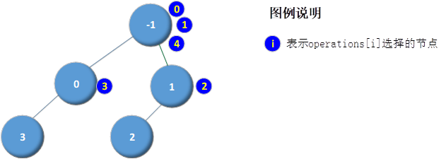

**思路解析：**

1) 我们要区分选择的节点和创建的节点，选择的是父节点，创建出来的是子节点。

例如示例1中，i=0时，operations[i]=[0,0] 表示选择第0层第0个创建的节点，即选择根节点；因为此时没有左子节点，所以创建左子节点（节点值等于i，即等于0）。

2) 因为我们要在每一层根据创建的顺序选择节点，所以需要记录每一层节点的创建顺序

记录每一层创建的顺序，用HASH或者数组这两种数据结构都可以；因为每一层的创建顺序数据是独立的，所以最外层还需要一维要表示层。

即需要二维的HASH（数组、map也可以），类似：hash[layer][index]

 

注意点：

leetcode树的题目，如果函数的返回值是TreeNode指针或者对象表示根节点，那么leetcode系统后台会根据这个根节点打印输出节点值；并不需要答题者自己打印输出每个节点的值。返回二叉树根节点的题目可以参考leetcode“剑指 Offer 07. 重建二叉树” https://leetcode.cn/problems/zhong-jian-er-cha-shu-lcof/

```python
# Definition for a binary tree node.
import collections
from typing import List, Optional


class TreeNode:
    def __init__(self, val, level, left=None, right=None):
        self.val = val
        self.level = level
        self.left = left
        self.right = right


class Solution:
    def __init__(self):
        self.node_map = collections.defaultdict(list)
        root = TreeNode(-1, 0)
        self.node_map[0].append(root)

    def create_tree(self, operations: List[List[int]]) -> Optional[TreeNode]:

        for idx in range(len(operations)):
            cur_level, cur_idx = operations[idx][0], operations[idx][1]
            node = self.node_map[cur_level][cur_idx]

            if not node.left:
                cur_node = TreeNode(idx, cur_level + 1)
                node.left = cur_node
                self.node_map[cur_level + 1].append(cur_node)

            elif not node.right:
                cur_node = TreeNode(idx, cur_level + 1)
                node.right = cur_node
                self.node_map[cur_level + 1].append(cur_node)

        return self.node_map[0][0]

    def levelOrder(self, root: Optional[TreeNode]) -> List[List[int]]:

        res = []
        if not root: return res

        queue = collections.deque()
        queue.append(root)
        level = 0  # 存储层数

        while queue:
            size = len(queue)  # 当前层数节点数量
            level += 1  # 当前层有节点，level + 1
            cur_res = []  # 临时变量，记录当前层的节点
            for _ in range(size):  # 遍历某一层的节点
                node = queue.popleft()  # 将要处理的节点弹出
                cur_res.append(node.val)
                # 如果当前节点有左右节点，则压入队列，根据题意注意压入顺序，先左后右
                if node.left:
                    queue.append(node.left)
                if node.right:
                    queue.append(node.right)

            res.append(cur_res)  # 某一层的节点都处理完之后，存入res

        return res


operations = [[0, 0], [1, 0], [1, 0], [2, 1], [2, 1], [2, 1], [2, 0], [3, 1], [2, 0]]
obj = Solution()
node = obj.create_tree(operations)
print(obj.levelOrder(node))

```

该解法通过 dist + list 实现。

字典对象 level_to_nodes 记录节点信息：key=层号， value是一个list（记录本层的所有创建的节点）。

level_to_nodes[h][idx] 选中的是父节点，而要创建的是其子节点，所以 level_to_nodes.setdefault 时层号 h 要加1表示在下一层添加节点。

代码非常简洁易懂。


------

#### ✅2023-01.13-2 故障通知和自检

某网络由若干节点组成，该网络具有一套故障通知及自检模型，如图所示：
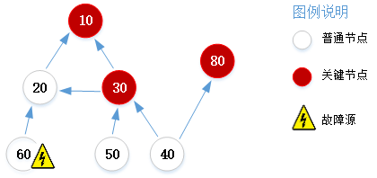


规则为：

1) 节点有两种类型：普通节点和关键节点；两种节点都可能产生故障，即为故障源。
2) 故障源会将异常信息通知到下游所有节点，如图所示：节点60为故障源，箭头指向的下游节点 20 和 10 会收到异常信息。
3) 满足如下规则之一需要自检：

l 故障源一定要自检；若故障源为关键节点，也会要求其所有上游节点自检。

l 收到异常信息的关键节点需要自检；这些关键节点也会要求其所有上游节点自检。

现给出一批节点及其上下游关系，及唯一的故障源，请找到所有需要自检的节点，并以节点编号升序输出。

输入

l 第一行一个整数 numNodes，表示节点的数量，1 <= numNodes <= 1000
接下来 numNodes 行，每行数据 nodes[i] 格式为`id:nextNodes`，表示编号为 id 的节点，及其下游相邻节点序列 nextNodes（0 <= nextNodes.length <= 100）

l 然后一行一个整数 numKeyNodes，表示关键节点的数量
接下来为 keyNodes 序列，0 <= keyNodes.length == numKeyNodes <= 1000

l 最后一行一个整数，表示故障源的节点编号

1 <= nodes[i].id <= 10000，且关键节点、故障源都在已给出的节点中

输出

一个整数序列，表示所有需要自检的节点编号，按升序输出

样例1

输入：

7

20:10

10:

30:10 20

60:20

40:80 30

50:30

80:

3

30 10 80

60

输出：

10 20 30 40 50 60

解释：

网元连接关系如题目图示：节点60的所有下游为20、10；关键节点10的所有上游为20、60、30、50、40。

故障源将异常信息通知到下游节点 20 和 10。

关键节点10 收到异常信息后，会进行自检，并要求其所有上游节点 20、30、60、50、40 进行自检。

最终所有需自检的节点为 10 20 30 40 50 60 （按升序排序）。

样例2

输入：

5

5:3

1:

2:5

3:1 2 4

4:5

3

3

输出：

2 3 4 5

解释：

连接关系如下图：
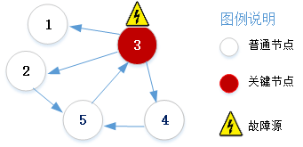


·     故障源 3 把异常信息通知到其下游 1、2、5、4，这些都是普通节点。

·     故障源 3 需要自检；它自身是关键节点，要求它的上游 5、4、2 也自检。

样例3

输入：

5

1:2

2:3

3:1

10000:1

7:0

1

输出：

1

解释：

都是普通节点。
只有故障源自检； 故障源不是关键节点，不会要求其上游节点自检。


2.  题目分析

**题目理解：**

给出一批节点及节点之间的关系，并且标识了哪些是关键节点、哪个是故障源节点，需要找出所有需要自检的节点编号，规则：

l 故障源一定要自检，例如题目图片中的节点60

l 故障源下游的关键节点需要自检（例如题目图片中的节点10），这些关键节点也会要求其所有上游节点自检

所以，我们需要做两件事：

Ø 传递异常信息

从故障源向下游遍历，找到所有需要自检的关键节点

Ø 找到自检节点

l 添加故障源到自检列表

l 添加故障源下游的关键节点到自检列表

l 从所有需要自检的关键节点向上游遍历，得到要自检的上游节点并添加到自检列表

图中可能有环路，要注意避免死循环。

**思路解析：**

图的遍历方式包括深度优先搜索（DFS）和广度优先搜索（BFS），其中DFS使用递归或栈进行实现，而BFS则采用队列进行实现。

以样例1为例，输入参数60:20 表示节点60是20的上游；也可以把60称作为20的前驱节点，20是60的后继节点。

我们要找到需要自检的节点，则必须找到关键节点，这就需要记录每个节点的前驱节点。

要找到关键节点，则需要从故障源出发，找到其下游节点，如果这些下游节点在关键节点keyNodes（函数参数）中存在，则添加到关键节点集合中。

*具体流程如下图所示：*

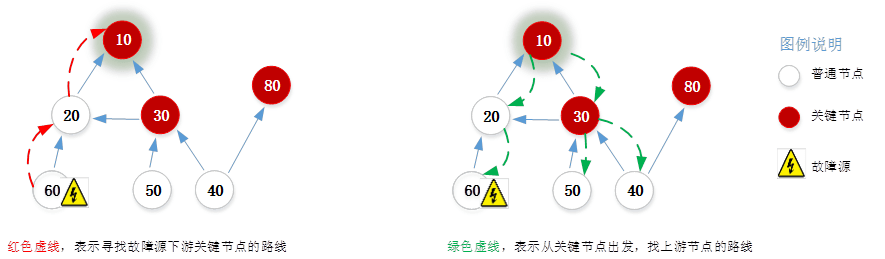

所以，处理步骤可以概括为两步：

l 第一步：找出故障点的所有下游类型为关键节点的节点，例如上图中节点10

l 第二步：从找出的关键节点出发，找到它们的上游节点，即为所有需要自检的节点

```python
import collections
from typing import Tuple, List


class Solution:

    def get_check_points(self, nodes: List[Tuple[int, List[int]]], key_nodes: List[int], org: int) -> List[int]:

        node_dicts = {}

        for node_rel in nodes:
            node_dicts[node_rel[0]] = node_rel[1]

        queue = collections.deque([org])
        key_nodes_to_check = set()

        while queue:
            node = queue.popleft()
            if node not in key_nodes_to_check:
                if node in key_nodes:
                    key_nodes_to_check.add(node)
                for node in node_dicts[node]:
                    queue.append(node)

        # print(key_nodes_to_check)  # [60, 20, 10]

        queue = collections.deque(list(key_nodes_to_check))
        key_nodes_to_check = set()

        while queue:
            node = queue.popleft()
            if node not in key_nodes_to_check:
                key_nodes_to_check.add(node)
                for key, val in node_dicts.items():
                    if node in val and key not in key_nodes_to_check:
                        queue.append(key)

        if org not in key_nodes_to_check:
            key_nodes_to_check.add(org)

        return sorted(list(key_nodes_to_check))


# nodes = [
#     [20, [10]],
#     [10, []],
#     [30, [10, 20]],
#     [60, [20]],
#     [40, [80, 30]],
#     [50, [30]],
#     [80, []]
# ]
#
# key_nodes = [30, 10, 80]
# org = 60

nodes = [
    [5, [3]],
    [1, []],
    [3, [1, 2, 4]],
    [2, [5]],
    [4, [5]]
]

key_nodes = [3]
org = 3
print(Solution().get_check_points(nodes, key_nodes, org))

```

该解法用的是DFS，只不过没有用递归，而是通过栈实现。

首先用字典对象 node_dic = dict() 记录每个节点的直接下游节点；key=节点编号, value=直接下游节点编号。

down_nodes 记录故障源所有下游节点编号。

List对象 up_nodes 记录所有需要自检的节点编号。

Ø for node in down_nodes: 在这个循环中，up_nodes 首先记录故障源下游的所有关键节点

借助于栈变量down_stack来判断是否处理完了；down_stack 和 down_nodes 的区别是 down_stack 是为了完成BFS，down_nodes 是要留下的。

如果是用队列，则为广度优先搜索；这里用的是栈，所以是深度优先搜索。

Ø 在 while up_stack: 循环中，遍历所有故障源下游的关键节点，找到它们各自的上游节点并添加到 up_nodes 中。

由于是循环判断，所以用栈还是队列都是一样的；用循环全量遍历所有节点，效率不高。


------

#### ✅2022-12.23-2 港口卸货

智能港口需实现一个卸货机制：有若干艘都装有 6 个集装箱的货轮即将到达港口，所有货轮到达港口的时刻 t 记录于一维升序数组 time 中（非严格递增）。
港口有 num 个起重机，每个起重机每单位时间可完成**一个**集装箱的卸货。
若一艘货轮在时刻 t 到达港口：

l 如果在 t + limit 时刻前无法完成其所有集装箱的卸货，则该货轮无需卸货，直接进入驳船区等待人工卸货；

l 否则尽早完成该艘货轮的卸货；一旦开始卸货，所用的起重机不允许被抢占。

请问有多少艘货轮需进入驳船区等待人工卸货。

**注意：** 货轮仅在到达港口后才可卸货；多个起重机可同时对一个货轮进行卸货工作。

**示例** **1**：

输入：
num = 4
time = [1,1,3]
limit = 2

输出：1

解释：如下图所示


·     时刻 1 船 0 到，完成一艘货轮卸货的时刻为 3，未超过时间限制；
时刻 1 再到 船 1，完成这艘货轮的卸货需要到时刻 4，会超出 1+2 的时间限制，因此这一艘货轮需要进入驳船区；

·     时刻 3 到达 船 2，完成这艘货轮卸货的时刻为 5，未超过时间限制；

因此共有 1 艘货轮需要进入驳船区，返回 1。

**示例** **2****：**

输入：
num = 5
time = [1,2,2,3,3,4,5,5]
limit = 3

输出：3

解释：如下图所示，
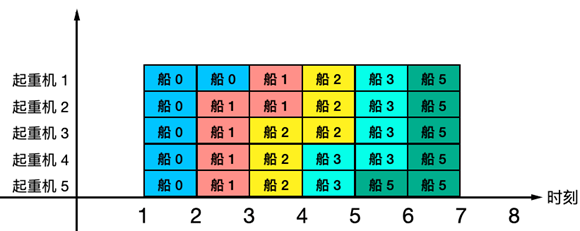

·     时刻 1 到达 1 艘货轮，完成 船0 卸货的时刻为 3；

·     时刻 2 到达 2 艘货轮，完成 船1 卸货的时刻为 4，完成 船2 卸货的时刻为 5；

·     时刻 3 到达 2 艘货轮，完成 船3 卸货的时刻为 6；船4 无法在规定时间内完成卸货，因此需要进入驳船区；

·     时刻 4 到达 1 艘货轮，完成 船5 卸货的时刻为 7；

·     时刻 5 到达 2 艘货轮，完成任意一艘卸货的时刻都为 9，超过时间限制；因此 2 艘货轮均需进入驳船区；

因此共有 3 艘货轮需要进入驳船区，返回 3。

**示例** **3****：**

输入：
num = 20
time = [3,3,5,5,5,5,5,5]
limit = 2

输出：0

**提示：**

1 <= num <= 20

1 <= limit <= 100

1 <= time.length <= 1000

1 <= time[i] <= time[i+1] <= 10^4

非严格递增：对于数组arr，都有 arr[i] <= arr[i+1]。


2. **题目分析**

**题目理解：**

需要模拟一个港口卸货系统。

每艘货轮都有6个集装箱，货轮到达港口的时刻记录于升序数组 time 中；起重机的数量是num。

若一艘货轮在时刻 t 到达港口，则t + limit 之前完成卸货才有效，否则需进入驳船区。

若一艘货轮无法整体完成卸货，则一个集装箱都不要卸载。

注意有可能在同一个时刻到达多艘船。

最后需要计算共有多少货轮进入驳船区。

**思路解析：**

如果只有一艘货轮，那么我们很容易就可以判断出是否能够完成卸货，原因是卸货完成的时刻容易计算出来。

当有多艘货轮时，我们只知道到达时刻，并不知道实际开始卸货的时刻；所以，记录每艘货轮完成卸货的进度是一个可行的方法。

1) 时间*起重机数量，得到一个位置矩阵

我们可以把时刻对应的横坐标看作行、把纵坐标看作列，这样我们就得到一个t * num 的位置矩阵。

矩阵左上角编号为0，然后从上往下、从左至右递增，如下图所示：

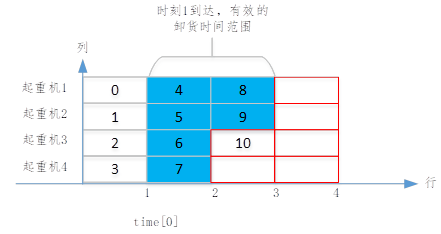

矩阵中每个格子有唯一的编号，每当到了一艘船之后，我们顺着前进的方向依次占6个格子代表对6个集装箱进行卸货。

设当前位置为pos（即格子的编号），那么占6个格子后的新位置是pos+6

l 新位置的行：row=(pos + 6)/num，表示卸货后对应的时刻；如果row > t + limit，说明超过限制时间

l 新位置的列：col=(pos + 6)%num，表示起重机的索引

这样一来，我们就得到了时间和位置的相互转换关系；每次只需要判断row是否超过限制时间，如果超过则pos回退到递增之前的值。

2) 货轮到达时刻对应的起始位置和pos的关系

设货轮在时刻 t 到达港口，货轮到达时刻对应的起始位置为pos1，则pos1=t * num；那么有两个可能：

Ø pos1 > pos

以示例1的time[2]=3为例，如下图所示：

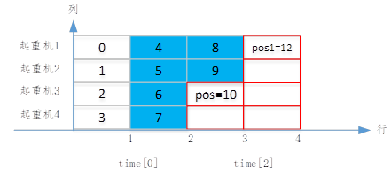

在处理完第一艘货轮后，pos递增到10；而pos1=3*4=12。

Ø pos1 <= pos

以示例2的time[2]=2为例：

pos=17、pos1=2*5=10

只有货轮到达港口后才能开始卸货，所以我们应该取max(pos, pos1)作为下一艘船的开始位置。

```python
class Solution:
    def getIdx(self, idx, num):  # 或者idx对应在matrix中的x, y坐标

        return idx // num, idx % num

    def get_manual_unloading_num(self, num: int, time: List[int], limit: int) -> int:
        res = 0
        matrix = [[0 for _ in range(max(time) + 1)] for _ in range(num)]
        available_start = 0  # 当前可用指示idx

        for start in time:
            expire = start + limit

            if start >= available_start:  # 可以直接装
                available_start = max(available_start, start * num)  # start对应的初始坐标
                available_start += 6
                x, y = self.getIdx(available_start, num)
                if x >= expire:  # 需要等待
                    res += 1
                    available_start -= 6
            else:
                cur_idx = available_start + 6
                x, y = self.getIdx(cur_idx, num)
                if x >= expire:
                    res += 1
                else:
                    available_start += 6

        return res
```


------


#### 2022-12.09-2 分页器

http://3ms.huawei.com/km/groups/3803117/blogs/details/13430679

在平时的网页中，我们经常看到信息内容通过分页来展示，分页器通常会根据我们的当前页码显示不同的页码按钮，用来引导用户翻页。下图所示的分页器，总页数为64（首页码为1，尾页码为64），最大显示宽度为9，当前页码为9

*显示宽度为页码按钮和**...**的数量，**...**表示页码不连续。*

给定总页数、最大显示宽度、当前页码，请模拟输出分页器的显示形态：

l 总页数小于等于最大显示宽度时，显示与总页数相等的按钮

l 总页数大于最大显示宽度时，需依次符合下面条件：

1) 显示按钮与...的数量之和等于最大显示宽度。
2) 第一个和最后一个按钮固定显示首尾页码，当前页码的按钮一定显示（可能是首尾页码按钮）。
3) 当且仅当首页或尾页与相邻按钮的页码不连续时，需使用...间隔。
4) 除首、尾、当前页外，其它按钮显示与当前页码前后连续的页码：

l 选择当前页码的前面按钮数与后面按钮数的差值的绝对值最小的方案；

l 如果差值最小有多个方案，选择前面按钮数多的方案。

l 显示按钮按页码从小到大排列

**输入**

三个正整数 pageCount maxWidth currentPage，分别表示总页数、最大显示宽度、当前页码

*2 <= pageCount <= 1000, 5 <= maxWidth <= 10, 1 <= currentPage <= pageCount*

**输出**

一个字符串，表示分页器的显示形态，用单空格间隔页码与...

**样例**

**输入样例** **1**

7 6 4

输出样例 1

1 ... 3 4 ... 7

提示样例 1

首页1、尾页7、当前页4，一定显示。
当前页前面按钮数与后面按钮数差值最小的方案有两种：1 … 3 4 … 7 或 1 … 4 5 … 7 ，选择前面按钮数多的方案。

其他方案，比如：1 2 3 4 … 7 的当前页前面按钮数（3个）与后面按钮数（1个）的差值不是最小； 1 … 3 4 5 7 的尾页7与相邻按钮的页码5不连续时没有 …

 

**输入样例** **2**

8 7 5

输出样例 2

1 ... 4 5 6 ... 8

提示样例 2

首页1、尾页8、当前页5，一定显示。 首页和尾页都与相邻按钮的页码不连续，使用 … 。 当前页前后按钮数相差最小（为0）。

错误答案如 1 … 4 5 6 7 8 ，该方案的前后按钮数相差 1

 

**输入样例** **3**

7 6 5

输出样例 3

1 ... 4 5 6 7

提示样例 3

当前页前后按钮数相差最小（为0）

错误答案如 1 … 4 5 … 7 ，该方案的前后按钮数相差 1

 

**输入样例** **4**

5 10 3

输出样例 4

1 2 3 4 5

提示样例 4

最大显示宽度足以显示所有页码，按实际页码数显示


**2.  题目分析**

**题目理解：**

在很多网站中，可以看到分页器的存在，例如3ms的博客：http://3ms.huawei.com/km/groups/3803117/home?l=zh-cn


分页器的作用是引导用户翻页；现给定总页数、最大显示宽度、当前页码，需要计算显示哪些按钮或省略号。

本题的需求细节有：

l 第一页、最后一页、当前页必须要显示

l 当前页有可能是第一页或最后一页

l 如果总页数小于等于最大显示宽度，直接显示所有页

l 首页或尾页与相邻按钮的页码不连续时，需使用...间隔（只有第一页的后面和最后一页的前面可以用…）。

l 如果有多种显示方案，采用*当前页的前面数字按钮数*和*后面数字按钮数*的差值的绝对值最小的

如果还是有多种方案，采用当前页的前面数字按钮数多的

l 每页按从小到大显示，页码范围是[1, pageCount]

*注：给定的输入参数最大显示宽度大于等于5**，所以至少能够保证**首、尾、当前页可以都显示出来。*

**思路解析：**

总体上有两种思路：a、从当前页往左右两边扩散，b、分场景确定页码范围。

Ø 1）从当前页往左右两边扩散

先将当前页码添加到链表中，然后循环直到页码用完为止，在循环中：

l 如果没有到达第一页：在链表头部左边添加一个页码，左边按钮数加1

l 如果没有到达最后一页：在链表尾部右边添加一个页码，右边按钮数加1

最后再根据左右两边按钮数是否平衡，来决定要不要修改第2页的页码为省略号、修改倒数第2页的页码为省略号。

Ø 2）分场景确定页码范围

按省略号出现的位置和次数，可以分为四种场景：

l 场景一：直接显示所有页、无省略号

因为需求说了“如果总页数小于等于最大显示宽度，直接显示所有页”，所以先把这种特殊情况处理了会简化代码。

l 场景二：只显示左边省略号


因为要求“前后按钮数之差的绝对值要最小”，所以当前页左右的按钮数要尽量均匀。

在当前页处于某个靠右位置时，右边的按钮数就会比左边的小，我们把从左至右第一个这样的位置称作为右分界点。

右分界点是：pageCount - maxWidth / 2，如果currentPage大于右分界点，那么说明左侧的按钮足够多，需要在左侧显示省略号、右侧不显示省略号。

l 场景三：只显示右边省略号

以输入数据 8 7 3 和 8 6 3 为例，如下图所示：


左分界点是maxWidth / 2，当currentPage <= maxWidth / 2时，首页码右边不显示省略号，在尾页码左边显示省略号；原因是无论maxWidth是奇数还是偶数，如果currentPage小于等于maxWidth的二分之一，说明左侧的按钮不够，所以不能在左侧显示省略号。

l 场景四：显示左右两个省略号

枚举完前面场景后，剩下的这种场景属于当前页处于中间位置的场景，如下图所示：


这种情况下，把任何一个省略号改为数字，都会使得前后按钮数之差的绝对值不是最小，故需要显示两个省略号。


```python
class Solution:

    def display_pages(self, page_count: int, max_width: int, current_page: int) -> str:

        if max_width >= page_count:

            return " ".join([str(i) for i in range(1, page_count + 1)])

 

        if current_page <= max_width // 2:

            page_info = " ".join([str(i) for i in range(1, max_width - 1)])

            return "{} ... {}".format(page_info, page_count)

 

        if current_page > page_count - max_width // 2:

            page_info = " ".join([str(i) for i in range(page_count - max_width + 3, page_count + 1)])

            return "1 ... {}".format(page_info)

 

        max_index = current_page

        min_index = current_page

        while max_index - min_index < max_width - 5:

            min_index -= 1

            if max_index - min_index < max_width - 5:

                max_index += 1

 

        page_info = " ".join([str(i) for i in range(min_index, max_index + 1)])

        return "1 ... {} ... {}".format(page_info, page_count)

 
```

也是先处理特殊场景，然后从当前页往左右两边扩散。

四种场景分别处理如下：

Ø 总页数小于等于最大显示宽度

显示与总页数相等的按钮，通过列表生成式将[1, page_count]范围的页码转换为字符串后，再通过join函数用空格连接起来。

Ø 当前页码 小于等于最大显示宽度的一半

首页码右边不显示省略号，在尾页码左边显示省略号

Ø 当前页码大于 (总页数 - 最大显示宽度 / 2)

首页码右边显示省略号，在尾页码左边不显示省略号

Ø 显示两个省略号

只需要计算出最小和最大的页码，min_index表示区间开始页码、max_index表示区间结束页码，然后用range函数返回整数列表。


#### [12.8提醒] ✅2022-11.25-1 目录树收缩显示

在一个目录树中（假设都是目录），过深的目录路径不容易展示，为了提升用户体验，需要对目录进行收缩展示，求收缩后某一深度的目录个数。
如图所示，原目录树及收缩后示意：

1. root          root
2. ├ B           ├ B/C/E
3. │ └ C          │ ├ N
4. │  └ E         │ └ M
5. │   ├ N        └ F
6. │   └ M         ├ H
7. └ F            └ X/i
8. ├ H
9. └ X
10. └ i

收缩规则：

·     若某目录仅有一个子目录，则把这个子目录收缩到其父目录，展示为一个新目录。如图所示，i 收缩到 X 变成新的目录 X/i。

·     所有符合上述条件的均需收缩，收缩后符合上述条件的继续收缩，直到无法收缩。如图所示，目录B、C、E收缩为新的目录 B/C/E

现给定一个原目录树 orgTree，请按照收缩规则展示为一个新目录树，求新目录树中深度值为 depth（根节点深度为 1）的节点个数。

如图所示，收缩后深度为 2 的节点有 2 个（B/C/E、F），深度为 3 的节点有 4 个（N、M、H、X/i）。

**输入**

一个整数 num，表示父子节点对的数量，1 <= num <= 300
接下来 num 行表示 orgTree，每行一个父子节点对，格式为父节点 子节点，节点名称仅含字母或数字，长度 [1,10]
最后一行一个整数 depth，1 <= depth <= 300

树只有一个根，首个节点对的父节点为根。
树上各节点名称是全局唯一的。
每个节点下的子节点不超过10个。

**输出**

一个整数，表示收缩后深度为 depth 的节点个数

**样例**

输入样例 1

9

root B

root F

C E

B C

E N

F H

F X

E M

X i

3

输出样例 1

4

提示样例 1

输入数据表示的原目录树，及收缩示意如题面图示，深度为 3 的节点有 4 个（N、M、H、X/i）

输入样例 2

3

1 B123456789

B123456789 c

1 b123456789

3

输出样例 2

0

提示样例 2

原目录树收缩后，不存在深度为 3 的节点，因此返回 0

输入样例 3

4

A B

B C

C D

D E

1

输出样例 3

1

提示样例 3

收缩显示为一个节点 A/B/C/D/E，深度 1 的节点数为 1


**题目理解：**

现给出一棵原始的目录树（只给了“父节点-子节点”对），按规则收缩（也可以称作为合并或者折叠）后，求深度为depth的节点个数：

l 规则1: 如果当前目录的子目录数为1，则向上收缩，直到无法收缩。

l 规则2: 根节点为orgTree[0][0]，唯一且深度为1。

注意，树上各节点名称是全局唯一的。

**思路解析：**

如果没有收缩的需求，那么只需要以深度优先或者广度优先的方式遍历整棵树，就可以得到结果。

要实现收缩的需求，有两个思路：

l 可以先收缩树节点，再遍历统计

例如，如果已经构建出树了，可以这样递归实现收缩：

```
func dfsMerge(node *treeNode) {

  parent := node

  for ; len(parent.children) == 1; {

​    // B-C 合并为 B/C

​    child := parent.children[0]

​    parent.name = parent.name + "/" + child.name

​    parent.children = child.children

  }

  for i, child := range node.children {

​    dfsMerge(child)

  }

}
```

l 也可以直接遍历统计，遇到需要收缩的节点不计算这一层的深度即可

```py
class Solution:

    def __init__(self):

        self.node_count = 0

 

    # org_tree每个元素为父子节点对，org_tree[i][0]为父节点，org_tree[i][1]为子节点

    def get_nodes_num(self, org_tree: List[Tuple[str]], depth: int) -> int:

        if depth > len(org_tree):

            return 0

        # 使用字典保存每一层数据, 先保存数据，模拟目录树

        layer_dict = {}

        for nodes in org_tree:

            node_left, node_right = nodes[0], nodes[1]

            if not layer_dict.get(node_left, []):

                layer_dict[node_left] = [node_right]

            else:

                layer_dict[node_left].append(node_right)

        self.dfs([org_tree[0][0]], layer_dict, 1, depth)

        return self.node_count

 

    def dfs(self, nodes, layer_dict, curren_layer, depth):

        if curren_layer == depth:

            self.node_count += len(nodes)

            return

        for node in nodes:

            value = layer_dict.get(node, [])

            # 如果只有一个元素，表示只有一层目录，直接继续dfs，不用更新

            if len(value) == 1:

                self.dfs(value, layer_dict, curren_layer, depth)

                continue

            # 当不是最后的叶子节点，而且也不是一个元素，

            if len(value) > 1:

                self.dfs(value, layer_dict, curren_layer + 1, depth)


```


------


#### ✅2022-11.11-2 流程图管理系统


请设计一个流程图管理系统，实现以下功能：

l addNode(int nodeId, int nodeType) —— 新增节点 nodeId，其类型为 nodeType。若节点 nodeId 不存在，则节点添加成功并返回 true；否则直接返回 false。

o  nodeType == 1 表示中继节点，系统中任意其他节点（包括之后增加的节点）到 nodeId 均自动建立一条单向连接；

o  nodeType == 0 表示普通节点，其他节点到此节点的连接需要手工创建。

l addConnection(int connectId, int startNodeId, int endNodeId) —— 手工创建一条编号为 connectId 的单向连接，起点为 startNodeId ，终点为 endNodeId 。

o  若存在节点 startNodeId 和 endNodeId，且 startNodeId != endNodeId，同时不存在编号为 connectId 的连接，则添加成功并返回 true；

o  否则直接返回 false。

l removeConnection(int connectId) —— 移除手工创建的编号为 connectId 的连接。

o  若存在 connectId 的连接，则移除成功并返回 true；否则直接返回 false。

l removeNode(int nodeId) —— 移除节点 nodeId 和以 nodeId 为起点和终点的所有连接。

o  若存在 nodeId ，则移除成功并返回 true；否则直接返回 false。

l query(int nodeId) —— 查找以 nodeId 为起点的所有连接（含自动和手工创建），并返回这些连接的终点列表（对节点编号去重后再升序排序）。若 nodeId 不存在或无连接，则返回空列表 []。

**示例** **1****：**

输入：
["FlowchartSys","addNode","addNode","addNode","addConnection","addNode","query","removeNode","removeConnection"]
[[],[100,0],[101,0],[102,1],[20,100,101],[105,1],[100],[101],[20]]
输出：[null,true,true,true,true,true,[101,102,105],true,false]

解释：
FlowchartSys sys = FlowchartSys(); // 初始化流程图管理系统。
sys.addNode(100,0); // 新增 普通 节点 100，返回 true。
sys.addNode(101,0); // 新增 普通 节点 101，返回 true。
sys.addNode(102,1); // 新增 中继 节点 102，返回 true。
sys.addConnection(20,100,101); // 手工创建编号为 20 的单向连接，起点为 100 ，终点为 101，返回 true。
sys.addNode(105,1); // 新增 中继 节点 105，返回 true。
sys.query(100); // 查找以节点 100 为起点的连接终点，如下图（1）所示，按升序返回 [101,102,105]。
sys.removeNode(101); // 移除节点 101 ，并移除以 101 为起点和终点的所有连接（含手工连接 20），如下图（2）所示，返回 true。
sys.removeConnection(20); // 连接 20 已不存在，返回 false。
注：输出中的 null 表示此对应函数无输出（其中：C 的初始化函数有返回值，但是也是无需输出）
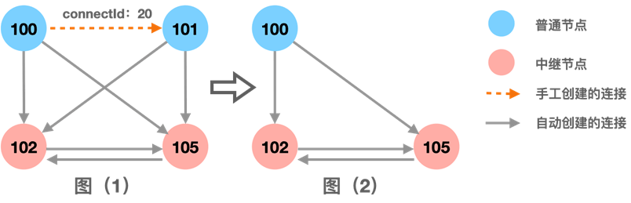

**示例** **2****：**

输入:
["FlowchartSys","addNode","query","addNode","addNode","addNode","addNode","query","addConnection","addConnection","addConnection","query","removeConnection","query","removeNode","removeNode"]
[[],[100,0],[100],[101,1],[102,1],[101,1],[103,0],[103],[20,100,102],[21,101,101],[10,100,102],[100],[20],[102],[102],[102]]

输出[null,true,[],true,true,false,true,[101,102],true,false,true,[101,102],true,[101],true,false]
解释：
FlowchartSys sys = FlowchartSys(); // 初始化流程图管理系统。
sys.addNode(100,0); // 返回 true。
sys.query(100); // 当前无以 100 为起点的连接，因此返回空列表 []。
sys.addNode(101,1); // 返回 true。
sys.addNode(102,1); // 返回 true。
sys.addNode(101,1); // 节点 101 已存在，返回 false。
sys.addNode(103,0); // 返回true。
sys.query(103); // 返回 [101,102]。
sys.addConnection(20,100,102); // 返回 true。
sys.addConnection(21,101,101); // 无法创建起点与终点都为 101 的单向连接，返回 false。
sys.addConnection(10,100,102); // 再手工创建一条 100 -> 102 的单向连接，编号为 10，返回 true。
sys.query(100); // 以节点 100 为起点的连接有：手工创建的到节点 102 的连接 20、10，以及自动创建的到节点 101、102 的连接，经去重排序后返回 [101,102]。
sys.removeConnection(20); // 返回 true。
sys.query(102); // 返回 [101]
sys.removeNode(102); // 返回 true
sys.removeNode(102); // 当前不存在节点 102 ，返回 false
注：输出中的 null 表示此对应函数无输出（其中：C 的初始化函数有返回值，但是也是无需输出）

**提示：**

·     1 <= addNode, addConnection, removeNode, removeConnection, query 的总调用次数 <= 1000

·     0 <= nodeId, connectId, startNodeId, endNodeId <= 10000

·     nodeType == 0 或 1

**初始化及调用参考（以** **C** **为例，其他语言参考）：**

/**

 \* Your FlowchartSys struct will be instantiated and called as such:

 \* FlowchartSys *sys = FlowchartSysCreate();

 \* bool param_1 = FlowchartSysAddNode(sys, nodeId, nodeType);

 \* bool param_2 = FlowchartSysAddConnection(sys, connectId, startNodeId, endNodeId);

 \* bool param_3 = FlowchartSysRemoveConnection(sys, connectId);

 \* bool param_4 = FlowchartSysRemoveNode(sys, nodeId);

 \* int *param_5 = FlowchartSysQuery(sys, nodeId, retSize);

 \* FlowchartSysFree(sys);

*/

**2.  题目分析**

**题目理解：**

需要设计一个流程图管理系统，共5个接口，涉及到两种元素类型：

l 节点：分为普通节点和中继节点

l 连接：分为手工连接和自动连接

如果节点A是中继节点，那么其它节点自动建立和中继节点A的单向连接；之后增加的节点也会自动建立一条到节点A的单向连接。

注意，删除节点时，和节点相连的连接也需要一起删除。

`参数``nodeId``、``connectId ``的`最大值不超过10000，意味着可以直接作数组下标。

**思路解析：**

1) 数据分析

以样例1为例，我们要管理两类对象：节点和连接，如下图所示：


手工创建的连接肯定需要记录，但是自动连接是否记录就有两个选择：

l 记录自动连接

l 不记录自动连接

因为无论是普通节点还是中继节点，都会创建自动连接（到中继节点），所以查询时遍历所有中继节点、将中继节点返回即可，并不真的一定要创建出连接。

2) 数据建模

节点和连接两类对象，相互有关系，如果定义为从属关系，则数据结构较复杂；如果分开管理，则清晰的多，如下图所示：


#### 2022-10.21-2 最小审批次数

某公司各级部门之间的连接关系为一颗多叉树结构，每个节点表示一个部门（有两个属性：部门id和部门研究的技术分类tech），父节点表示上级部门；以样例1数据为例，连接关系如下：
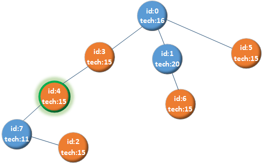
现给定各个部门的连接关系和tech，及你所在部门myDeptId，你需要查阅所有与你部门tech相同的其它部门的资料，查阅资料的审批流程如下：

·     查阅每个部门的资料都需要进行一次申请

·     假设你申请查阅部门B的资料，审批规则为：

·     如果你的部门是B的上级部门（含直接和间接），则不需要审批。

·     如果你的部门不是B的上级部门（含直接和间接），则需要你的上级部门逐层审批：

·     若B是你的上级部门（含直接和间接），则审批到B结束；

·     若B不是你的上级部门，则审批到距离两部门最近的同一个上级部门。

*注：每审批一次审批次数加 1 。*

请计算并返回累计的审批次数。

**解答要求**时间限制：1000ms, 内存限制：256MB

**输入**

首行是一个整数 num，表示部门数量，部门id从 0 到 num - 1，1 <= num <= 1000
接下来一行的整数序列techs表示这num个部门的技术分类，下标为部门id，1 <= techs[i] <= 20

然后一行是整数 row，表示部门上下级关系数据的行数，1 <= row <= 999
接下来row行，每行第一个数字表示一个部门id，第二个数字表示直接下级部门的数量，后面的数字表示直接下级部门id。

*1 <=* *直接下级部门的数量 <= 100*

最后一行是你所在部门 myDeptId

*输入保证部门id合法，且仅能构建一棵树*

**输出**

一个整数，表示累计的审批次数

**样例**

输入样例 1

8

16 20 15 15 15 15 15 11

5

0 3 3 1 5

3 1 4

1 1 6

4 1 7

7 1 2

4

输出样例 1

5

提示样例 1

连接关系如题目图示：申请者id4的部门的tech为15，其它tech为15的部门有部门2，部门3, 部门5, 部门6
四次申请的审批如下：

l 查阅部门2，部门4是部门2的上级部门，不需要审批

l 查阅部门3，依次需要 部门3 审批，审批 1 次

l 查阅部门5，依次需要 部门3 -> 部门0 审批，审批 2 次

l 查阅部门6，依次需要 部门3 -> 部门0 审批，审批 2 次

因此累计审批次数为 5

输入样例 2

6

16 13 16 14 12 15

3

0 2 4 1

4 2 2 5

1 1 3

0

输出样例 2

0

提示样例 2

部门0的tech为16
tech同为16的节点是部门2，部门0是部门2的上级部门（间接上级），因此不需要审批。


**题目理解：**

查阅每个部门的资料都需要进行一次申请，即每次申请是独立计算次数的。

申请的目标部门不同，即使申请路径的上级部门相同，也要重新计算申请次数。

如果查询资料位于自己的平级部门，则需要一路向上申请到自己部门与目标部门的共同上级部门（最近公共祖先）。

上级部门查询下级部门，不需要审批。

**思路解析：**

我们可以先简化问题，只考虑单个部门的审批过程，需要三个步骤：

l 找到tech属性和myDeptId相同的部门B

l 找到myDeptId和部门B两个节点的最近公共祖先X

l 计算myDeptId和X之间的深度差，即为需要的审批次数

除了查找最近公共祖先外，还可以通过DFS等方法搜索到目标节点从而得到深度差，下面分别展开描述。

**1)** **查找最近公共祖先**

根据给定的列表，很容易找到和你所在部门myDeptId相同tech属性的节点，然后计算myDeptId和这些相同tech节点的最近公共祖先，最近公共祖先与myDeptId之间的深度差，就是审批的次数。

查找最近公共祖先有很多实现方法，其中一种思路是：

l 将myDeptId所有祖先节点按照由近到远的顺序存入数组list1，然后遍历所有值相同的节点，寻找这些节点的祖先节点存入数组list2，如果某祖先节点list2[j]出现在myDeptId的list1中，则当前祖先节点的下标j就是和myDeptId之间的距离。

**2)** **DFS****搜索目标节点**

本题如果用树的深度优先遍历算法，由于出发点不一定是root节点，所以除了遍历子节点外，还需要遍历父节点。

本题要查询的部门可能是多个，至少有两种遍历方法：

Ø 方法1：遍历所有tech属性相同的部门，分别调用DFS函数一次（效率不高）

为了判断出上级还是下级部门，我们可以先初始化每个节点的深度，以样例1为例，假设要查找部门6（其深度为3）：

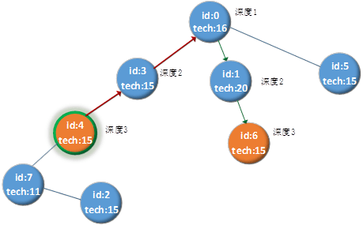

从节点id=4出发，在DFS函数中遍历整棵树，每遍历下一个节点前，记录下一个节点的“前驱节点”为当前节点。

当找到目标节点6后，再通过一个while循环逆序回到初始节点4，并且在循环中判断如果“后继节点”比“前驱节点”的深度小，step++。

例如：逆序从id0到id3时，“后继节点”id0的深度为1、“前驱节点”id3的深度为2，则审批次数加1。

这种方法是将从源到宿中间经过的节点以链表的形式记录下来，再逆序遍历链表，就可以判断出需要的审批次数。

从后面的代码，我们可以看到更多不同的实现方法。

Ø 方法2：调用DFS函数一次，完成所有节点的遍历

这种方法在找到一个tech属性相同的节点后，并不会停止搜索，而是继续搜索剩余节点，直到所有节点都被遍历过一次。

由于所有节点只需要搜索一次，所以效率很高，见员工5的GO代码。

```python
class Solution:

    def get_approval_times(self, relations: List[List[int]], techs: List[int], my_dept_id: int) -> int:

        result = 0

        techs_num = len(techs)

        reverse_relations = [[techs[i],[i]] for i in range(techs_num)]

        for relation in relations:

            for i in relation[2:]:

                reverse_relations[i][1] = reverse_relations[i][1] + reverse_relations[relation[0]][1]

        path_len = len(reverse_relations[my_dept_id][1])

        for i in range(techs_num):

            if reverse_relations[i][0] == techs[my_dept_id]:

                for j in range(path_len):

                    if reverse_relations[my_dept_id][1][j] in reverse_relations[i][1]:

                        result += j

                        break

        return result
```

该解法也是用交集查找最近公共祖先，将每个节点的父节点整理为list，然后判断两个tech相同的节点的父节点列表是否存在交集。

list变量reverse_relations记录了每个节点的父节点列表，下标i表示节点id，reverse_relations[i]又是一个list，内容为[tech, [父节点列表]]

以样例1为例，所有节点的父节点列表如下图所示：

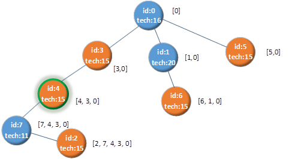

在父节点列表建立好之后，下面代码就开始寻找父节点交集，本质上还是查找公共祖先，关键代码注释如下：

```python
for i in range(techs_num): # 遍历所有节点 
    if reverse_relations[i][0] == techs[my_dept_id]: # 如果节点i的tech属性和节点my_dept_id相同
        for j in range(path_len): # 遍历节点my_dept_id的所有父节点
            if reverse_relations[my_dept_id][1][j] in reverse_relations[i][1]: # 如果父节点在节点i的父节点列表中
                result += j # 说明reverse_relations[my_dept_id][1][j] 就是公共祖先,下标j就是距离my_dept_id的深度
                break
```

该解法只用了一个list记录所有节点的祖先节点列表，从而实现了查找公共祖先，思路还是有些不同；但是时间复杂度是*O*(N3)，效率并不高。


#### ✅2022-09.16-2 光通信激光穿透材料测试

材料实验室研究员正在研究激光在新型透光玻璃中传输时的衰减效果。

给定多层上下叠放的介质，每层介质等长，并划分成若干个单位长度为 1 的格子。planks记录了从上到下每层的介质信息，planks[i] 表示第 i 层介质从左到右的透光玻璃放置情况，其中：

·     1 表示该位置有透光玻璃，可穿过激光；每层**至少**包含了一块透光玻璃；

·     0 表示该位置为不透光介质，无法穿过激光；

图中有三层介质，如下所示：
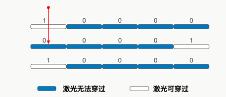

研究员从最上方、任意位置垂直向下发射激光，每次移动可以将任意一层介质左移（或右移）一个单位长度。
请问研究员**最少**需要移动多少次介质，可使激光能垂直穿过**所有**介质（即每层介质都需要被穿过）。

**示例** **1****：**

输入：planks = [[1,0,0,0,0],[0,0,0,0,1],[1,0,0,0,0]]

输出：4

解释：planks 的行表示层、列表示位置：从上往下依次为第 0 层、第 1 层、第 2 层，如上图所示。
最佳方案为：第 1 层介质向左移动 4 次。激光从位置 0 （即第 0 层未移动前的下标）向下发射，可穿过这三层介质。

注：将第 1 层介质向右移动 1 次的方案是不可行的，因为此时任意位置都无法穿过所有介质。

**示例** **2****：**

输入：planks = [[0,1,0,0,0],[1,0,0,0,0],[0,0,1,0,0],[0,0,0,1,1]]

输出：4

解释：
一种可行方案：
第 0 层介质右移 1 次；
第 1 层介质右移 2 次；
第 2 层介质不移动；
第 3 层介质左移 1 次；
一共移动 4 次，激光从位置 2 （即第 0 层未移动前的下标）向下发射，可穿过所有介质。
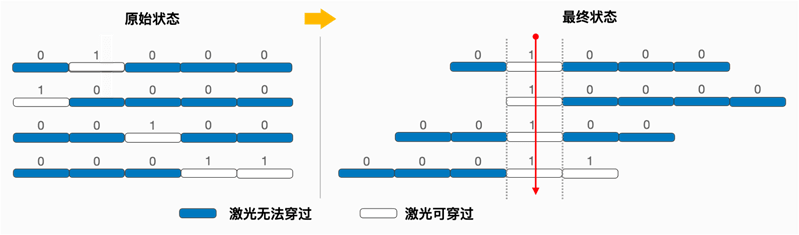

**示例** **3****：**

输入：planks = [[1,1,1,1,1],[1,1,1,1,1],[1,1,1,1,1]]

输出：0

**提示：**

- 2 <= planks[i].length <= 1000
- 2 <= planks.length <= 1000
- 0 <= planks[i][j] <= 1
- 温馨提醒：纯暴力解法通过用例不多，请考虑高效的解法


------

#### ✅2022-08.19-2 数据竞争分析

某并发处理程序包含若干个线程，每个线程执行的指令简化为4种：

- read(x): 读取名为 x 的数据块
- write(x): 改写名为 x 的数据块
- lock: 申请并获得全局唯一的互斥锁
- unlock: 释放互斥锁

需要静态分析若干数据块在不同线程间是否会出现数据竞争。对于某数据块，数据竞争的规则如下：

- 若该数据块在**多个**线程（大于等于2，如 A、B …）中被读写、且**至少一个**为写操作，对于其中的任意一个写操作（假设其所在线程为 A），只要存在下面两种情况之一，则存在数据竞争：
  - 如果线程 A 中该写操作未获得锁
  - 其它线程（B …）的任一读写未获得锁
- 其它场景视为不存在数据竞争。

现给出所有线程的指令序列，请找出所有存在数据竞争的数据块，并按字典序升序输出；如果所有数据块都不存在数据竞争，输出空序列[]。

**输入**

- 第一行一个整数 threadNum，表示线程个数，1 <= threadNum <= 10
  接下来 threadNum 行，每行表示一个线程的指令内容：第一个数字表示指令数量，其后依次输入每一条指令
- *1 <=* *指令数量* *<= 100
  **指令中的数据块名由小写字母组成，**1 <=* *数据块名的长度* *<= 10
  **输入保证：**lock* *和* *unlock* *成对出现，且无嵌套*

**输出**

- 所有存在数据竞争的数据块的序列（字典序升序），或空序列[]

**样例**

输入样例 1

2

4 read(para) write(msg) read(para) write(port)

7 write(port) lock read(msg) unlock write(buff) read(buff) read(para)

输出样例 1

[msg port]

提示样例 1

- 对数据块para，所有线程只有读没有写，因此无数据竞争；
  对数据块buff，只有一个线程读写，因此无数据竞争；
  对数据块msg，有两个线程读写，写操作未获取锁，因此有数据竞争；
  对数据块port，有两个线程写，写操作都没有获取锁，因此有数据竞争。
- 存在数据竞争的数据块为 msg、port，按字典序升序输出。

 

输入样例 2

3

7 read(apple) lock write(banana) unlock lock write(banana) unlock

5 read(orange) lock read(banana) write(orange) unlock

4 lock read(orange) unlock read(apple)

输出样例 2

[]

提示样例 2

- 对数据块apple，所有线程只有读，因此无数据竞争；
  对数据块banana，所有线程读写时都获取了锁，因此无数据竞争；
  对数据块orange，写操作已加锁，其它线程的读操作也已经加锁，因此无数据竞争（注：因为只有一个写操作，该写操作所在线程的读操作可以不加锁）

 

输入样例 3

3

4 lock read(a) write(a) unlock

6 lock read(a) unlock read(a) write(b) read(b)

3 lock write(a) unlock

输出样例 3

[a]

提示样例 3


**题目理解：**

这道题是模拟多线程编程中对数据块的保护。通过理解题目，我们可以得知存在数据竞争的数据块需要同时满足下面条件：

l 至少被两个线程访问，并且至少被一个线程写

l 其中一个线程读或者写操作未获得锁

**思路解析：**

根据题目需求，我们可以画出如下流程图来判断一个数据块是否存在竞争：

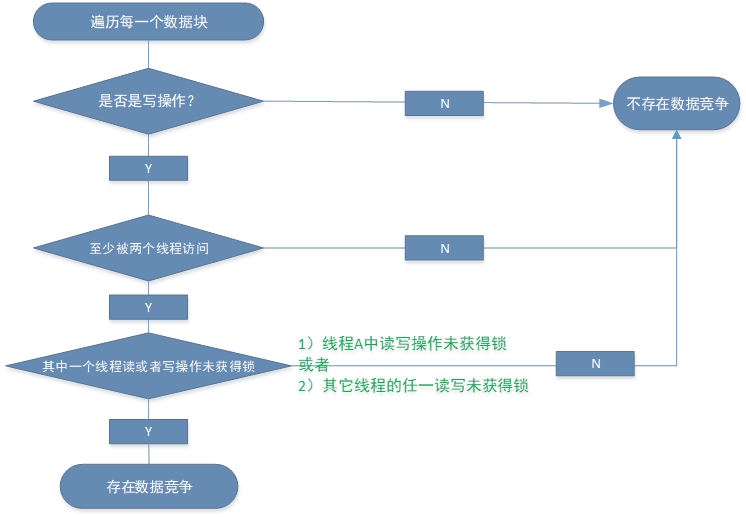

反过来，不存在数据竞争的数据块需要满足下面条件之一：

l 只有一个线程读写

l 所有线程只有读没有写

l 所有线程读写时都获取了锁

由于每个数据块必须是有写操作才可能存在数据竞争，所以我们容易想到从包含write操作的数据块入手（即从数据块的视角来看），在其它线程中寻找同名的数据块，如果找到；

l 只要其它任何一个线程中没有对此数据块进行保护，则存在数据竞争

l 包含write操作的数据块没有保护，则存在数据竞争

由于线程个数不超过10，指令数量不超过100，所以可以用四层循环来判断，下面看看大家的具体实现。

```py
class Solution:
    # 在遍历所有线程所有数据块之前，先对数据块信息做了统计：
    # data_stat 记录每个数据块，在几个线程中出现
    # write_stat 记录每个有写操作的数据块，对应的线程索引列表
    def getAcount(self, ops):
        data_stat, write_stat = collections.defaultdict(list), collections.defaultdict(list)

        for idx, thread in enumerate(ops):
            for op in thread:
                if op[0] == "lock" or op[0] == "unlock":
                    continue
                cur_op, data = op[0], op[1]
                if idx not in data_stat[data]:
                    data_stat[data].append(idx)
                if cur_op == "write" and idx not in write_stat[data]:
                    write_stat[data].append(idx)
        # pprint(data_stat)
        # pprint(write_stat)
        return data_stat, write_stat

    def get_data_races(self, thread_ops: List[List[Tuple[str, str]]]) -> List[str]:
        data_stat, write_stat = self.getAcount(thread_ops)
        res = []

        for thread_idx, thread_op in enumerate(thread_ops):
            locked = False
            for cur_op in thread_op:
                if cur_op[0] == "lock":
                    locked = True
                    continue
                elif cur_op[0] == "unlock":
                    locked = False
                    continue
                cur_op, data = cur_op[0], cur_op[1]
                if data in res:
                    continue
                if len(data_stat[data]) > 1 and len(write_stat[data]) > 0 and not locked and \
                    ((cur_op == "write") or  # 线程 A 中该写操作未获得锁 + 其它线程（B …）的任一写未获得锁
                     (thread_idx not in write_stat[data])):  # 其它线程（B …）的任一读未获得锁
                    res.append(data)

        return sorted(res)
```


------


#### ✅2022-01.21-1 仓库管理系统

http://3ms.huawei.com/km/groups/3803117/blogs/details/11724707?l=zh-cn

请设计一个仓库管理系统，实现如下功能：

·     StorageSystem(int coldStorageNum, int coldStoragePrice, int normalStorageNum, int normalStoragePrice, int delay) — 初始化仓库信息。

o  仓库有冷藏和常温两种类型的储藏室，初始化其对应的数量和每天租赁价格；

o  若客户租赁过期且超出 delay 天后，依旧未提取货物，该储物区将被清空；

·     store(int date, int storageId, int storageType, int storageDays) — 在日期 date 为存单 storageId 租赁 storageType 类型的**一个**储藏室，并存放物品 storageDays 天。

o  若有空间则存储成功，则需预付 storageDays 天的费用（按照实际使用储藏室类型进行计算：天数 * 每日租赁价格），返回该费用；

§ 当常温储藏室空间不足时，可使用空闲的冷藏储藏室存储；反之不可以；

§ date 为「租赁起始日期」，日期超过 date + storageDays 时开始过期

o  若无空间则不做任何处理，并返回 -1。

系统保证 storageId 参数全局唯一。storageType 为 0 表示冷藏， 1 表示常温。

·     retrieve(int date, int storageId) — 在日期 date ，客户取出存单 storageId （存单一定存在且未被提取）对应的物品：

o  若存单未过期时，则取出物品，并返回 0；

o  若存单过期但未超出 delay 天，则取出物品，并返回需要补交的费用（实际延迟天数 * 每日价格），实际延迟天数 = date - (「租赁起始日期」+ storageDays)；

o  若存单过期且已超出 delay 天（日期超过 「租赁起始日期」+ storageDays + delay ）时，则物品已被清空、取出失败，并返回 -1。

·     query(int date) — 请返回截止日期 date 时 3 种状态的存单数量序列，依次为：物品已成功取出、物品未取仍在仓库中、物品被清空的存单数量。

**注意**：保证函数 store、retrieve、query 的日期 date 参数按输入顺序非严格递增；

**示例** **1****：**

输入：
["StorageSystem","store","retrieve","query"]
[[2,2,1,1,2],[0,1,0,2],[3,1],[3]]

输出：[null,4,2,[1,0,0]]

解释：
StorageSystem obj = StorageSystem(2,2,1,1,2); // 初始化仓库，2 个冷藏室（每天价格 2）和 1 个常温室（每天价格 1），货物最多可以延期 2 天；
obj.store(0,1,0,2); // 在日期 0，存单 1 预定冷藏室 2 天；由于存在空闲冷藏室，返回支付款项 2*2 = 4
obj.retrieve(3,1); // 在日期 3 提取存单 1 对应物品。实际延迟天数为 1 = 3 - (0 + 2)，返回补交费用 2*1 = 2 ；因过期但未超出 2 天，不会被清空，
obj.query(3); // 当前物品已成功取出、物品未取仍在仓库中、物品被清空的存单各有 1 份、0 份、0 份，返回 [1,0,0]
注：输出中的 null 表示此对应函数无输出（其中：C 的构造函数有返回值，但是也是无需输出）

**示例** **2****：**

输入：
["StorageSystem","query","store","store","store","query","store","retrieve","store","query","query","retrieve"]
[[2,2,1,3,2],[0],[0,21,1,3],[1,22,1,4],[1,23,0,2],[1],[4,26,1,2],[5,21],[6,24,0,7],[7],[8],[9,22]]

输出：[null,[0,0,0],9,8,4,[0,3,0],-1,6,14,[1,2,1],[1,1,2],-1]

解释：
StorageSystem obj = StorageSystem(2,2,1,3,2); // 初始化仓库，2 个冷藏室（每天价格 2）和 1 个常温室（每天价格 3），货物最多可以延期 2 天；
obj.query(0); // 返回 [0,0,0]
obj.store(0,21,1,3); // 返回支付款项 3*3=9
obj.store(1,22,1,4); // 日期 1，存单编号 22，预定常温室 4 天；由于无未租赁的常温室，租赁冷藏室，返回 4*2=8
obj.store(1,23,0,2); // 返回支付款项 2*2=4
obj.query(1); // 返回 [0,3,0]
obj.store(4,26,1,2); // 由于无未租赁的常温室和冷藏室，返回 -1
obj.retrieve(5,21); // 此时存单 21 延迟天数为 2 = 5 - (0 + 3)，需补交费用为 2*3=6
obj.store(6,24,0,7); // 由于存单 23 过期且超出 2 天未提取（6 > 1 + 2 + 2），物品被清空。因此存在未租赁的冷藏室，返回 7*2=14
obj.query(7); // 返回 [1,2,1]
obj.query(8); // 由于存单 22 过期且超出 2 天未提取使物品清空，返回 [1,1,2]
obj.retrieve(9,22); // 此时存单 22 已被清空，返回 -1;
注：输出中的 null 表示此对应函数无输出（其中：C 的构造函数有返回值，但是也是无需输出）

**提示：**

1 <= store, retrieve, query 累计操作数 <= 1000

1 <= coldStorageNum, normalStorageNum <= 100

1 <= coldStoragePrice, normalStoragePrice <= 100

0 <= storageId <= 1000

0 <= date <= 10^4

1 <= delay, storageDays <= 100

0 <= storageType <= 1


2. **题目分析**

**题目理解：**

设计一个仓库管理系统，加上构造函数共4个接口。

每个存单从租赁开始，日期有三种可能状态：

以示例1为例：// 在日期 0，存单 1 预定冷藏室 2 天，货物最多可以延期 2 天(delay=2)

| 日期 | 0                 | 1    | 2      | 3          | 4          | 5                       |
| ---- | ----------------- | ---- | ------ | ---------- | ---------- | ----------------------- |
| 说明 | 开始租赁，预定2天 |      | 到期日 | 延迟天数=1 | 延迟天数=2 | 租赁过期且超出 delay 天 |

租赁过期且超出 delay 天后，依旧未提取货物，该储物区将被清空，例如在日期5这天。

本题有两个难点：

l 常温储藏室空间不足时，常温和冷藏室的转换

l 找到时机处理物品被清空的存单

**解题思路：**

1) 设计建模


在编码之前，先设计建模以便理清楚有哪些对象、对象之间的关系，这样不至于写到一半代码发现数据结构设计错了导致返工。

需要记录两类储藏室价格和数量，冷藏室价格、常温区价格、dealy……这些属性属于仓库管理系统，所以不需要保存到单独的类中。

每个存单对象，最好用一个单独的类/结构体保存，这样更好维护。

2) 盘点存单的时机

因为要求“若客户租赁过期且超出 delay 天后，依旧未提取货物，该储物区将被清空”，所以需要找一个时机来处理物品被清空的存单。

经过分析我们可以发现：由于并没有一个定时器机制，只有在三个操作接口中进行。

多次调用时，已经清理过的存单不能再次清理，所以清理后需要记录。

3) 统计3 种状态的存单数量的方法

可以分为记录法和遍历统计法。

记录法，又可以细分为计数法和容器统计法；前者是用整数变量实时计数，后者是将存单id加入到容器中再返回容器的size()。


```python
class Entity:
    def __init__(self, date, storageId, storageType, storageDays, price, cost):
        self.date = date
        self.storageId = storageId
        self.storageType = storageType
        self.storageDays = storageDays
        self.price = price
        self.cost = cost


class StorageSystem:
    def __init__(self, cold_storage_num: int, cold_storage_price: int, normal_storage_num: int,
                 normal_storage_price: int, delay: int):

        self.store_info = {
            0: [cold_storage_num, cold_storage_price],  # cold number, cold price
            1: [normal_storage_num, normal_storage_price]
        }
        self.delay = delay
        self.success_put = {}
        self.instorage = {}
        self.cleared = {}

    def store(self, date: int, storage_id: int, storage_type: int, storage_days: int) -> int:
        # store里面update是为了time时把位置空出来 让新存的有地方
        self.update_storage(date)
        if storage_type == 0:  # cold
            if self.store_info[0][0] > 0:
                self.store_info[0][0] -= 1
                cost = storage_days * self.store_info[0][1]
                self.instorage[storage_id] = Entity(date, storage_id, storage_type, storage_days, self.store_info[0][1],
                                                    cost)
                return cost
            return -1
        else:  # noranal
            if self.store_info[1][0] > 0:
                self.store_info[1][0] -= 1
                cost = cost = storage_days * self.store_info[1][1]
                self.instorage[storage_id] = Entity(date, storage_id, storage_type, storage_days, self.store_info[1][1],
                                                    cost)
                return cost
            elif self.store_info[1][0] == 0 and self.store_info[0][0] > 0:
                self.store_info[0][0] -= 1
                cost = storage_days * self.store_info[0][1]
                self.instorage[storage_id] = Entity(date, storage_id, 0, storage_days, self.store_info[0][1], cost)
                return cost
            return -1

    def retrieve(self, date: int, storage_id: int) -> int:
        # retrieve指定了对应的订单处理 本身会更新与本次操作有关的三种状态存单的数量 不用额外去全量update
        if not self.instorage.get(storage_id):  # 可能已经被拿出去了
            return -1
        entity = self.instorage.pop(storage_id)
        self.store_info[entity.storageType][0] += 1
        vaild_date = entity.date + entity.storageDays
        entire_date = vaild_date + self.delay
        # 未过期
        if date <= vaild_date:
            self.success_put[storage_id] = entity
            return 0
        # 过期，但是没有超出delay
        elif vaild_date < date <= entire_date:
            self.success_put[storage_id] = entity
            need_to_cost = (date - vaild_date) * entity.price
            return need_to_cost
        # 过期且超出delay
        elif date > entire_date:
            self.cleared[storage_id] = entity
            return -1

    def query(self, date: int):
        # query里面update是为了获取最新time的三种状态存单的数量
        self.update_storage(date)
        return len(self.success_put), len(self.instorage), len(self.cleared)

    def update_storage(self, date):

        for id, entity in list(self.instorage.items()):
            if entity.date + entity.storageDays + self.delay < date:
                del self.instorage[id]
                self.store_info[entity.storageType][0] += 1
                self.cleared[id] = entity


if __name__ == '__main__':
    # test1
    # obj = StorageSystem(2, 2, 1, 1, 2)
    # print(obj.store(0, 1, 0, 2))
    # print(obj.retrieve(3, 1))
    # print(obj.query(3))

    # test2
    obj = StorageSystem(2, 2, 1, 3, 2)
    print(obj.query(0))
    print(obj.store(0, 21, 1, 3))
    print(obj.store(1, 22, 1, 4))
    print(obj.store(1, 23, 0, 2))
    print(obj.query(1))
    print(obj.store(4, 26, 1, 2))
    print(obj.retrieve(5, 21))
    print(obj.store(6, 24, 0, 7))
    print(obj.query(7))
    print(obj.query(8))
    print(obj.retrieve(9, 22))
```


#### [12.8提醒] 2021-05.21-1 租房信息查询系统

请设计一个租房信息查询系统，需要实现如下功能：

l addRoom(int id, int area, int price, int rooms, int[] address)：在系统中增加一套编号为 id，面积为 area，月租金为 price，卧室数量为 rooms，地址坐标为 address（格式为 [横坐标x, 纵坐标y]）的房源：

 

若系统中不存在编号为 id的房源，则添加该房源，返回 true；

若已存在，则将对应房源信息 **更新** 为新传入的 area、price、rooms 与 address，并返回 false；

l deleteRoom(int id)：删除系统中编号为 id 的房源：

 

若存在编号为 id 的房源，删除此房源并返回 true；若不存在，返回 false。

l queryRoom(int area, int price, int rooms, int[] address, int[][] orderBy)：查询系统中符合筛选条件的房源，并按排序要求返回房源编号的序列。其中：

  Ø 筛选条件：面积大于等于 area，月租金小于等于 price，卧室数为 rooms 的房源；

  Ø 排序要求：按orderBy中的排序条件依次进行排序；若按orderBy排序结果仍相同（含orderBy为空），则按房源编号升序排列。

orderBy的元素格式为 [parameter,order]。

² parameter取值范围[1,3]， 1（表示 area）、2（表示 price）、3（表示房源坐标与address的曼哈顿距离）；

² order取值仅为 1 和 -1，1（表示升序）、-1（表示降序）。

例如 orderBy = [[3,1],[1,-1]] 表示先按照曼哈顿距离升序排列；若曼哈顿距离相同，再按照面积降序排列；若依然相同，则按编号升序排列。

 

示例 1：

输入：

["RentingSystem","addRoom","addRoom","queryRoom","deleteRoom"]

[[],[3,24,200,2,[0,1]],[1,10,400,2,[1,0]],[1,400,2,[1,1],[[3,1],[2,-1]]],[3]]

输出：[null,true,true,[1,3],true]

解释：

RentingSystem obj = RentingSystem();

obj.addRoom(3,24,200,2,[0,1]); // 在系统中添加编号为 3，面积为 24，月租金为 200，卧室数为 2，坐标为 [0,1] 的房源，返回 true

obj.addRoom(1,10,400,2,[1,0]); // 在系统中添加编号为 1，面积为 10，月租金为 400，卧室数为 2，坐标为 [1,0] 的房源，返回 true

obj.queryRoom(1,400,2,[1,1],[[3,1],[2,-1]]); // 查询系统中面积大于等于 1，月租金小于等于 400，卧室数为 2 的房源，查询所在地坐标为 [1,1]，先按照距离升序排序，结果相同，再按照月租金降序排序，编号为 1 的月租金大于编号为 3 的月租金，所以返回 [1,3]

obj.deleteRoom(3); // 删除编号为 3 的房源，返回 true

注：输出中的 null 表示此对应函数无输出（其中：C 的构造函数有返回值，但是也是无需输出）

 

示例 2：

输入：

["RentingSystem","deleteRoom","addRoom","addRoom","addRoom","addRoom","addRoom","addRoom","queryRoom","queryRoom"]

[[],[10],[3,24,200,2,[0,1]],[3,24,500,2,[0,1]],[3,27,500,4,[1,1]],[1,27,500,4,[20,43]],[6,35,227,4,[2,4]],[9,20,3540,4,[4,321]],[25,900,4,[10,1],[[1,1],[2,-1],[3,1]]],[25,900,4,[10,1],[]]]

输出：[null,false,true,false,false,true,true,true,[3,1,6],[1,3,6]]

解释：

RentingSystem obj = RentingSystem();

obj.deleteRoom(10); // 返回 false

obj.addRoom(3,24,200,2,[0,1]); // 返回 true

obj.addRoom(3,24,500,2,[0,1]); // 返回 false

obj.addRoom(3,27,500,4,[1,1]); // 返回 false

obj.addRoom(1,27,500,4,[20,43]) // 返回 true

obj.addRoom(6,35,227,4,[2,4]) // 返回 true

obj.addRoom(9,20,3540,4,[4,321]) // 返回 true

obj.queryRoom(25,900,4,[10,1],[[1,1],[2,-1],[3,1]]) // 查询系统中面积大于等于 25，月租金小于等于 900，卧室数为 4 的房源，先按照面积升序排列，接着按月租金降序排列，最后按曼哈顿距离升序排列。返回 [3,1,6]。

obj.queryRoom(25,900,4,[10,1],[]) // 查询系统中面积大于等于 25，月租金小于等于 900，卧室数为 4 的房源，由于orderBy为空，则按房源编号升序排列。返回 [1,3,6]。

注：输出中的 null 表示此对应函数无输出（其中：C 的构造函数有返回值，但是也是无需输出）

 

提示：

3 <= addRoom, deleteRoom, queryRoom 累计操作数 <= 1000

1 <= id <= 1000

1 <= area <= 1000

1 <= price <= 10^4

1 <= rooms <= 10

address.length == 2

0 <= address[0], address[1] <= 10^4

0 <= orderBy.length <= 3, orderBy[i].length == 2

1 <= orderBy[i][0] <= 3

orderBy[i][1] == -1 or 1

若 i != j 则 orderBy[i][0] != orderBy[j][0]

曼哈顿距离：地址1(x1, y1) 与 地址2(x2, y2)的曼哈顿距离，计算公式 = |x1 - x2| + |y1 - y2|。


**题目理解：**

1) 本题是增删改查的设计题

queryRoom(int area, int price, int rooms, int[] address, int[][] orderBy)：查询系统中符合筛选条件的房源，并按排序要求返回房源编号的序列。

有两个要求：**筛选、排序**。

排序条件orderBy是一个二维数组，orderBy[i][j]的取值范围如下：

orderBy[i][0] 取值为[1,3] ：1（表示 area）、2（表示 price）、3（表示房源坐标与address的曼哈顿距离）

orderBy[i][1]取值为1或者-1：1（表示升序）、-1（表示降序）

 

2) 以第二个示例倒数第二个查询为例，人工分析

obj.queryRoom(25,900,4,[10,1],[[1,1],[2,-1],[3,1]]) // 查询系统中面积大于等于 25，月租金小于等于 900，卧室数为 4 的房源

分析：

9,20,3540,4,[4,321] 月租金不满足，跳过9；此时符合筛选条件的有3条记录：

3,27,500,4,[1,1]

1,27,500,4,[20,43]

6,35,227,4,[2,4])

计算曼哈顿距离后，用表格形式展现为：

| **id** | **area** | **price** | **rooms** | **distance** |
| ------ | -------- | --------- | --------- | ------------ |
| 1      | 27       | 500       | 4         | 52           |
| 3      | 27       | 500       | 4         | 9            |
| 6      | 35       | 227       | 4         | 11           |

按照题意，排序条件如下[[1,1],[2,-1],[3,1]]

Ø [1,1]表示优先按面积升序排列：1和3面积是相等的，都是27；6的面积35最大，所以6肯定是最后。

Ø [2,-1]表示在面积相同情况下，接着按月租金降序排列，1和3都是500，1和3的顺序不变。

Ø [3,1]表示如果前面条件还相同，再按曼哈顿距离升序排列，1的距离是 |20-10| + |43-1|=52; 3的距离是 |1-10| + |1-1|=9，升序排列的结果是3在1的前面

所以，返回 [3,1,6]。

3) 通过数据库来验证

如果以数据库来分析，设数据库表名为RentingSystem，则SQL查询命令为：select id,area,price,rooms,distance FROM RentingSystem **order by area,price DESC,distance,id**

如果手上没有可用的数据库系统，我们也可以在EXCEL中通过SQL查询命令来验证下：

SQL语句：select id,area,price,rooms,distance FROM [Sheet1$] order by area,price DESC,distance,id 查询结果为：

| **id** | **area** | **price** | **rooms** | **distance** |
| ------ | -------- | --------- | --------- | ------------ |
| 3      | 27       | 500       | 4         | 9            |
| 1      | 27       | 500       | 4         | 52           |
| 6      | 35       | 227       | 4         | 11           |

可以看到，和人工分析的一致。


**解题思路：**

按筛选和排序的顺序可以分为两种实现方法：先筛选再排序、先排序再筛选，差别不是很大。

从运行效率来讲，先筛选再排序效率更高。

排序有两种方法：

l 实现一个cmp函数，只sort一次-->推荐做法

l 反向遍历orderBy数组调用sort四次-->效率比较低，且排序算法必须是稳定排序才行，不推荐

sort+cmp的分工是：sort是排序算法，cmp是比较器、实现的是元素的两两比较。

在有两个排序条件情况下：只有排序条件1无法区分两个元素的大小时才需要处理排序条件2。

**需要考虑解决的实现问题：**

Ø 用什么数据结构存储房源信息

Ø 比较函数cmp的入参实际指向的数据类型（和上一个问题紧密相关）

Ø 如何将函数queryRoom的排序条件orderBy传递到比较函数cmp中

Ø 如何处理升序和降序

1) 用什么数据结构存储房源信息

由于每套房源信息有一个唯一的id：房源编号，所以很自然想到用 hash(map/dict)来存储所有房源。

又因为1 <= id <= 1000，数据规模不大，所以用数组来存储也很方便。

 

对于每套房源信息，可以用一个结构体/类来保存，因为id/area/price/rooms/address都是整数，所以也可以用一个int数组来保存。

2) 比较函数cmp的入参原型是void*，实际的数据类型是什么（主要是C语言涉及这个问题）

这里主要又分为两种做法：

l 每套房源信息的指针（int * 或者Room*）

l 房源id或者数组下标

3) 如何将函数queryRoom的排序条件orderBy传递到比较函数cmp中

这个和具体语言相关。

l 对于非C语言，通常用lambda表达式传递

l 对于C语言，可以用全局变量传递，或者将排序条件包装到cmp函数的入参中

4) 如何处理升序和降序

比较高效的做法是将比较结果乘以orderBy[i][1]，尽量避免分成多个函数对于升序、降序各写一部分代码。


```python
from typing import List


class Room:
    def __init__(self, id: int, area: int, price: int, rooms: int, address: List[int], dist=0):
        self.id = id
        self.area = area
        self.price = price
        self.rooms = rooms
        self.address = address
        self.dist = dist


class RentingSystem:

    def __init__(self):
        self.room_map = {}

    def add_room(self, id: int, area: int, price: int, rooms: int, address: List[int]) -> bool:

        if id not in self.room_map:
            self.room_map[id] = Room(id, area, price, rooms, address)
            return True
        else:
            cur_room = self.room_map[id]
            cur_room.area = area
            cur_room.price = price
            cur_room.rooms = rooms
            cur_room.address = address
            return False

    def delete_room(self, id: int) -> bool:
        if id in self.room_map:
            self.room_map.pop(id)
            return True
        else:
            return False

    def query_room(self, area: int, price: int, rooms: int, address: List[int], order_by: List[List[int]]) -> List[int]:

        availd_rooms = []  # id, area, price, rooms, address, dist

        for key, value in self.room_map.items():
            if value.area >= area and value.price <= price and value.rooms == rooms:
                dist = abs(address[0] - value.address[0]) + abs(address[1] - value.address[1])
                availd_rooms.append([value.id, value.area, value.price, dist])

        order_by.append([0, 1]) # default order: id

        availd_rooms.sort(key=lambda x: [x[order[0]] * order[1] for order in order_by])

        return [room[0] for room in availd_rooms]


obj = RentingSystem()

# case1
# print(obj.add_room(3, 24, 200, 2, [0, 1]))
# print(obj.add_room(1, 10, 400, 2, [1, 0]))
# print(obj.query_room(1, 400, 2, [1, 1], [[3, 1], [2, -1]]))
# print(obj.delete_room(3))

# case2
print(obj.delete_room(10))
print(obj.add_room(3, 24, 200, 2, [0, 1]))
print(obj.add_room(3, 24, 500, 2, [0, 1]))
print(obj.add_room(3, 27, 500, 4, [1, 1]))
print(obj.add_room(1, 27, 500, 4, [20, 43]))
print(obj.add_room(6, 35, 227, 4, [2, 4]))
print(obj.add_room(9, 20, 3540, 4, [4, 321]))
print(obj.query_room(25, 900, 4, [10, 1], [[1, 1], [2, -1], [3, 1]]))
print(obj.query_room(25, 900, 4, [10, 1], []))

```
